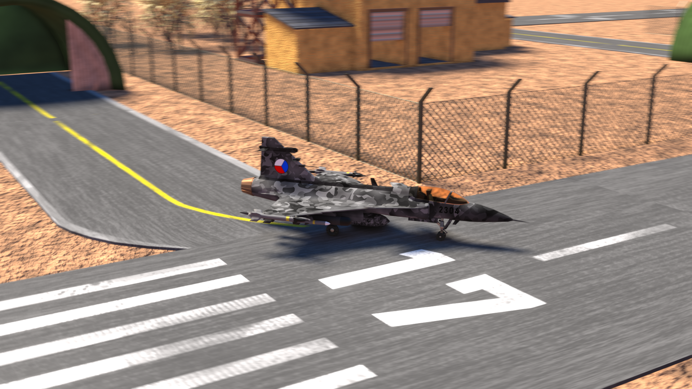
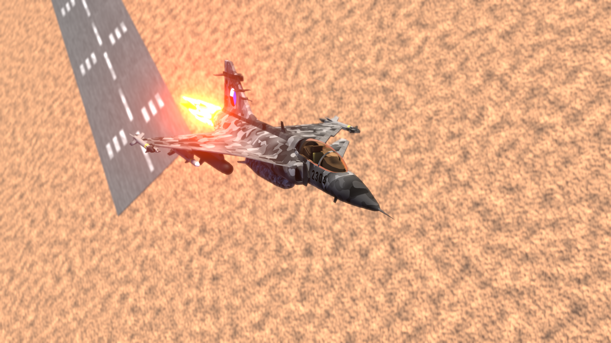
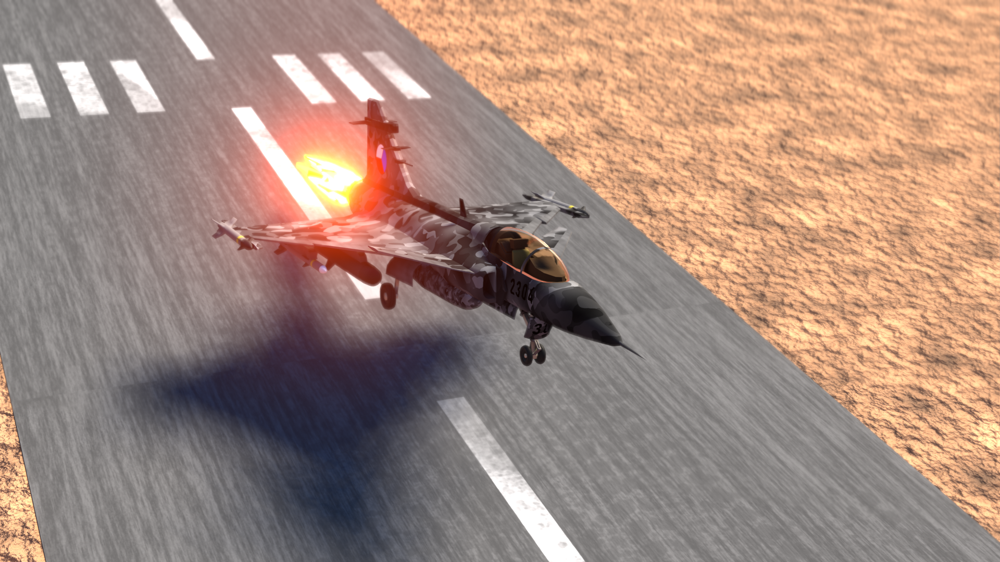
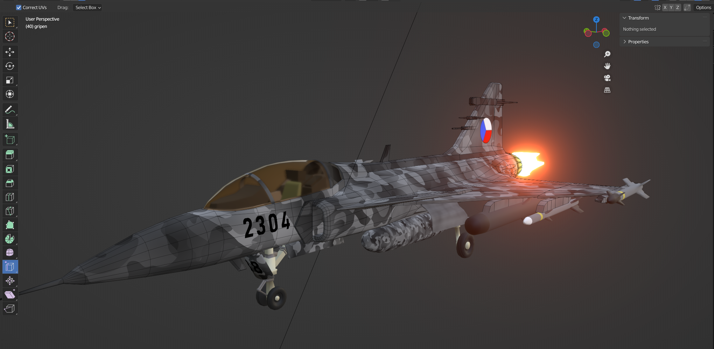

# Jet Fighter Gripen Animation

[GO BACK](https://github.com/0xMartin/UTB-FAI-programs)

This project showcases an animation of the flight of the JAS 39 Gripen jet fighter, created using Blender. The animation was created as a final project for the Blender course in the second semester of the Bachelor's degree program at UTB FAI.

## Preview

Here are some preview images of the final animation:

> Gripen Model Screenshot

To view the animation, you can open the gripen_animation.blend file in Blender and press the play button on the timeline. Alternatively, you can render the animation to a video file using Blender's rendering tools.