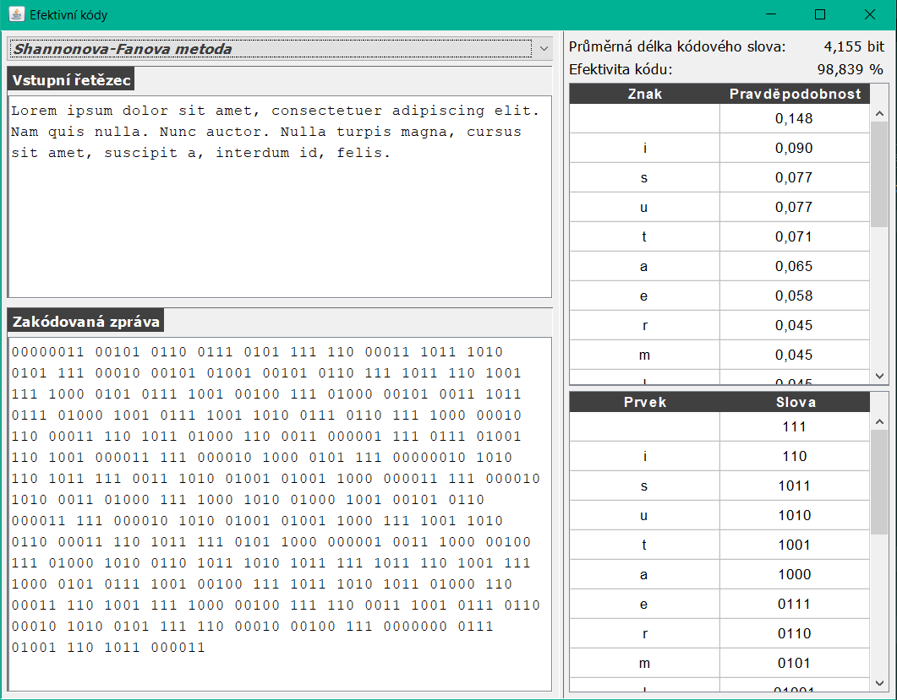
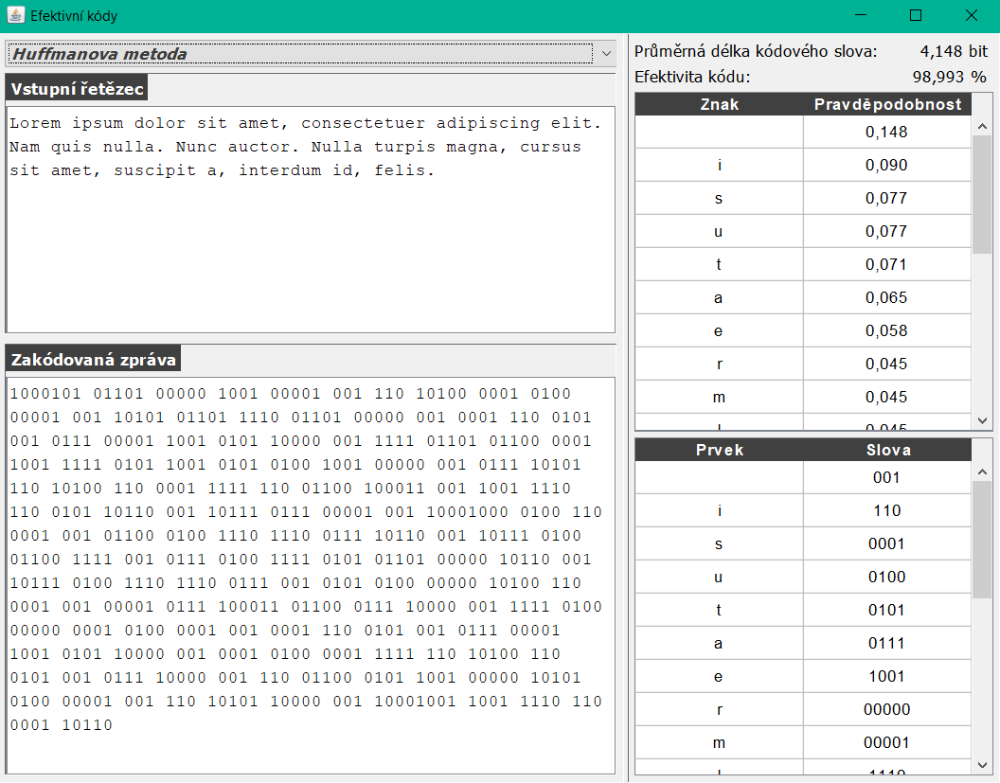

# Effective Codes

[GO BACK](https://github.com/0xMartin/UTB-FAI-programs)

## Description
This program is designed for encoding text using the method of effective coding. The program allows for encoding text using either the Shannon-Fano method or the Huffman method.

