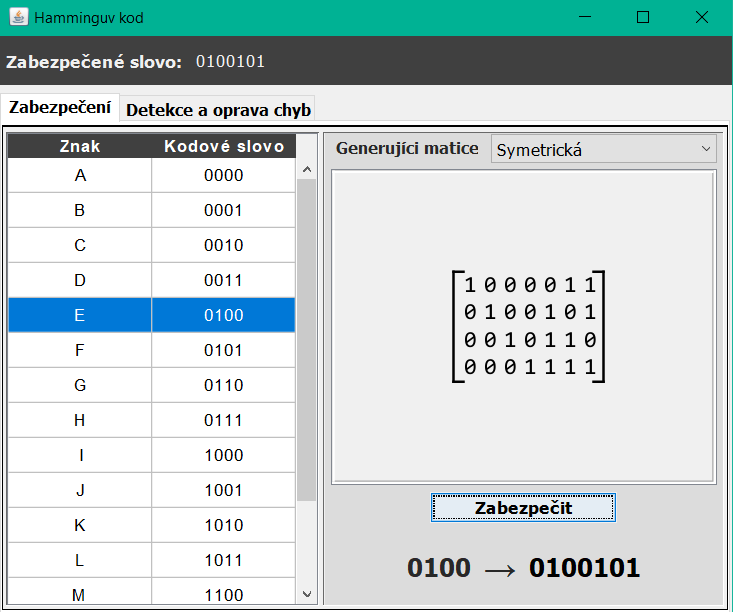
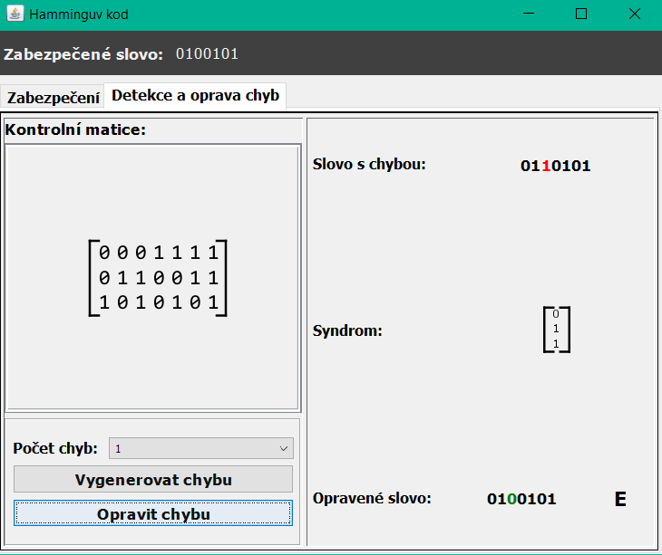

# Hamming code (7, 4)

[GO BACK](https://github.com/0xMartin/UTB-FAI-programs)

## Description
This program is designed for securing and checking code words. The program is capable of securing a code word using the Hamming code K(7, 4). The program also allows for errors to be generated in the secured code word, which it can correct (max. 1 error). The program offers several different generating matrices that can generate a symmetric or asymmetric code. The values of this matrix can be changed.

