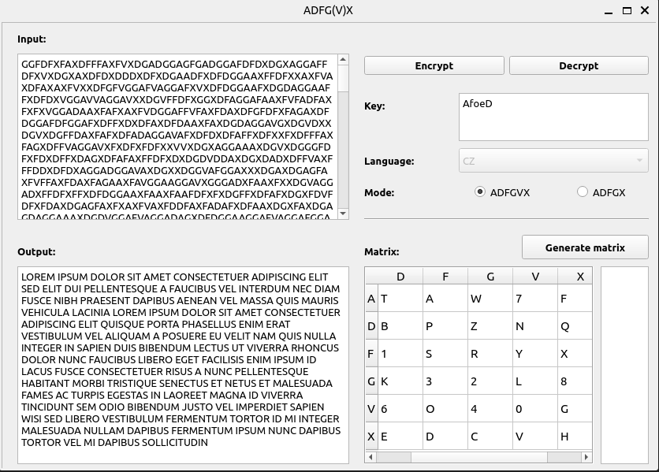

# ADFGVX cipher

[GO BACK](https://github.com/0xMartin/UTB-FAI-programs)

This application is a GUI tool for encrypting and decrypting text using the ADFGVX cipher. It is written in Python and uses PyQt5 for the graphical user interface.

## Features

* Allows encryption and decryption of text using the ADFGVX cipher.
* Allows the user to enter a password that will be used to encrypt/decrypt the message.
* Allows the user to generate their own encryption matrix.
* Supports both Czech and English languages.

## Usage

The main executable file is "main.py". Upon opening the application, the user is presented with a graphical user interface that allows them to input the plaintext message, select encryption options, and enter a password. The user can then encrypt the message by clicking on the "Encrypt" button and decrypt it by clicking on the "Decrypt" button.

The user can also generate a custom encryption matrix by clicking on the "Generate Matrix" button. This will open a new window where the user can enter their own matrix values.

 

## Requirements
* Python 3.x
* PyQt5 library

## Installation
1. Clone or download the repository.
1. Install the PyQt5 library if not already installed.
1. Run "main.py" to start the application.

## Limitations
* The ADFGVX cipher is not as secure as modern encryption methods, so it should not be used for sensitive information.
* The size of the encryption matrix is fixed at 6x6, so the user cannot create matrices of different sizes.