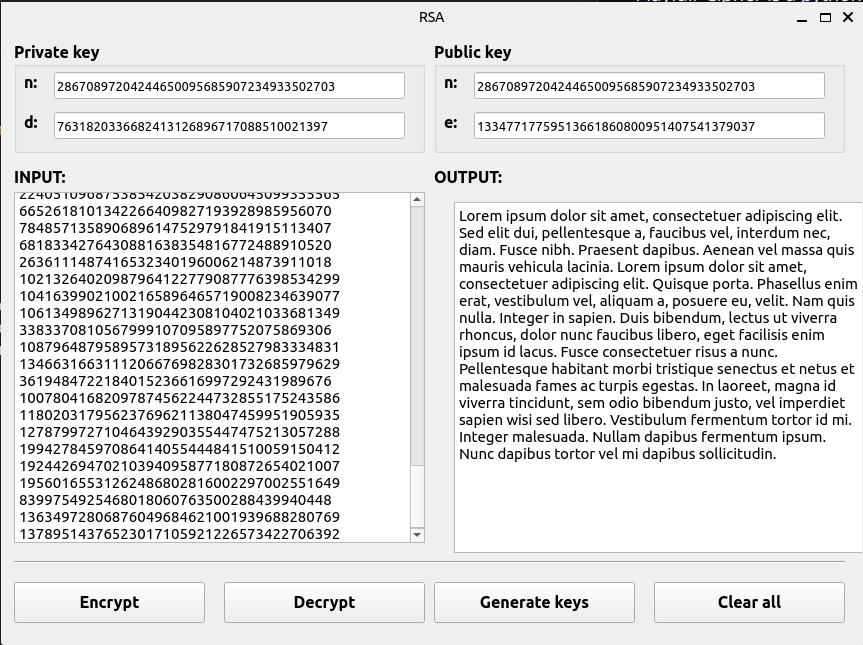

# RSA

[GO BACK](https://github.com/0xMartin/UTB-FAI-programs)

## Description

This program allows you to generate RSA keys and encrypt/decrypt messages.

## How to Use

### Generating Keys

To generate RSA keys, run the program and click the "Generate Keys" button. This will prompt you to enter a prime number. Once you have entered a prime number, the program will generate a public and private key pair.

### Encrypting Messages

To encrypt a message, enter the message in the "Message to Encrypt" field and click the "Encrypt" button. This will prompt you to enter the recipient's public key (which should have been provided to you by the recipient). Once you have entered the public key, the program will encrypt the message and display the encrypted message in the "Encrypted Message" field.

### Decrypting Messages

To decrypt a message, enter the encrypted message in the "Encrypted Message" field and click the "Decrypt" button. This will prompt you to enter your private key. Once you have entered your private key, the program will decrypt the message and display it in the "Decrypted Message" field.

 

## Installation

1. Install Python 3.5 or later.
1. Install PyQt5 by running the following command in your terminal:

```
pip install PyQt5 
```