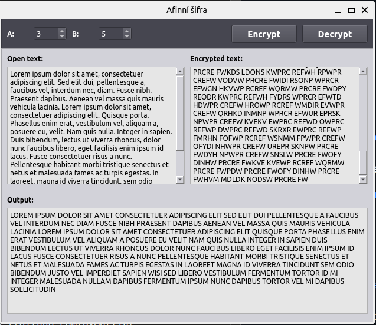

# Affine Cipher

[GO BACK](https://github.com/0xMartin/UTB-FAI-programs)

## Description

This Python application provides an implementation of the Affine Cipher encryption and decryption algorithm. It uses PyQt5 for the graphical user interface.

The Affine Cipher is a type of monoalphabetic substitution cipher that uses a mathematical function to encrypt plaintext. It is a combination of two functions, one being a multiplication function and the other being an addition function.

The main executable file for this program is "affinecipher.py". It provides the user with the option to encrypt or decrypt text using the Affine Cipher algorithm.

 

## Installation

1. Install Python 3.5 or later.
1. Install PyQt5 by running the following command in your terminal:

```
pip install PyQt5 
```

Usage

1. Launch the application by running the "affinecipher.py" file.
1. Enter the plaintext that you wish to encrypt or the ciphertext that you wish to decrypt.
1. Choose your encryption or decryption settings, including the values of the key variables __A__ and __B__.
1. Click the "Encrypt" or "Decrypt" button to apply the chosen operation to the entered text.
1. The output will be displayed in the text box below.