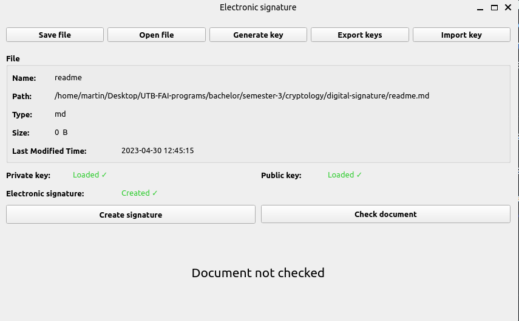

# Digital signature

[GO BACK](https://github.com/0xMartin/UTB-FAI-programs)

## Description
This application allows you to load and sign any file with a digital signature. The signed file can then be verified to ensure its authenticity. The digital signature is created using the RSA algorithm with a 2048-bit key size. The application also generates a public and private key pair for the user. The public key can be shared with others to verify signatures, while the private key must be kept secure and not shared.

 

## Requirements
* Python 3.x
* PyQt5 library

## Installation
1. Clone or download the repository.
1. Install the PyQt5 library if not already installed.
1. Run "main.py" to start the application.
