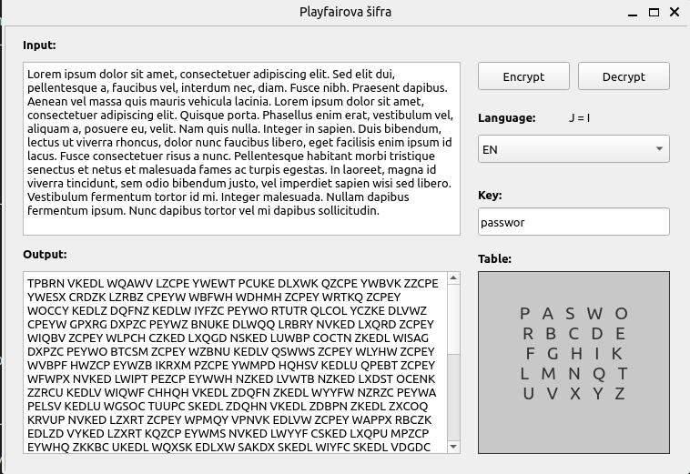

# Playfair cipher

[GO BACK](https://github.com/0xMartin/UTB-FAI-programs)

## Description

Playfair Cipher is a python application that allows users to encrypt and decrypt text using the Playfair cipher. The application uses PyQt5 for its graphical user interface (GUI). The user can enter a password that will be used to generate the encryption matrix. The user can also choose between the Czech or English language for the interface. The main executable file is "main.py".

 

## Installation

1. Install Python 3.5 or later.
1. Install PyQt5 by running the following command in your terminal:

```
pip install PyQt5 
```

Usage

1. Run the command python main.py to start the application.
1. Enter the text to be encrypted or decrypted in the input field.
1. Enter a password to generate the encryption matrix.
1. Click the "Encrypt" or "Decrypt" button to perform the corresponding operation.
1. The output will be displayed in the output field.