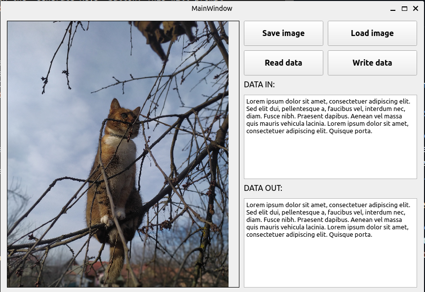

# Steganography

[GO BACK](https://github.com/0xMartin/UTB-FAI-programs)

## Description

This steganography application allows you to hide a message within an image by modifying the least significant bits of the color values. You can also extract a hidden message from an image. The modified image can be saved.

## Usage
1. Load an image by clicking the "Load Image" button.
1. Type your message into the "DATA IN" text box.
1. Click "Write data" to encode your message into the image. The modified image will be displayed in the "Image Preview" area.
1. To save the modified image, click the "Save Image" button.
1. To decode a hidden message from an image, load the modified image and click "Read data". The hidden message will be displayed in the "Message" text box.

 

## Installation

1. Install Python 3.5 or later.
1. Install PyQt5 by running the following command in your terminal:

```
pip install PyQt5 
```