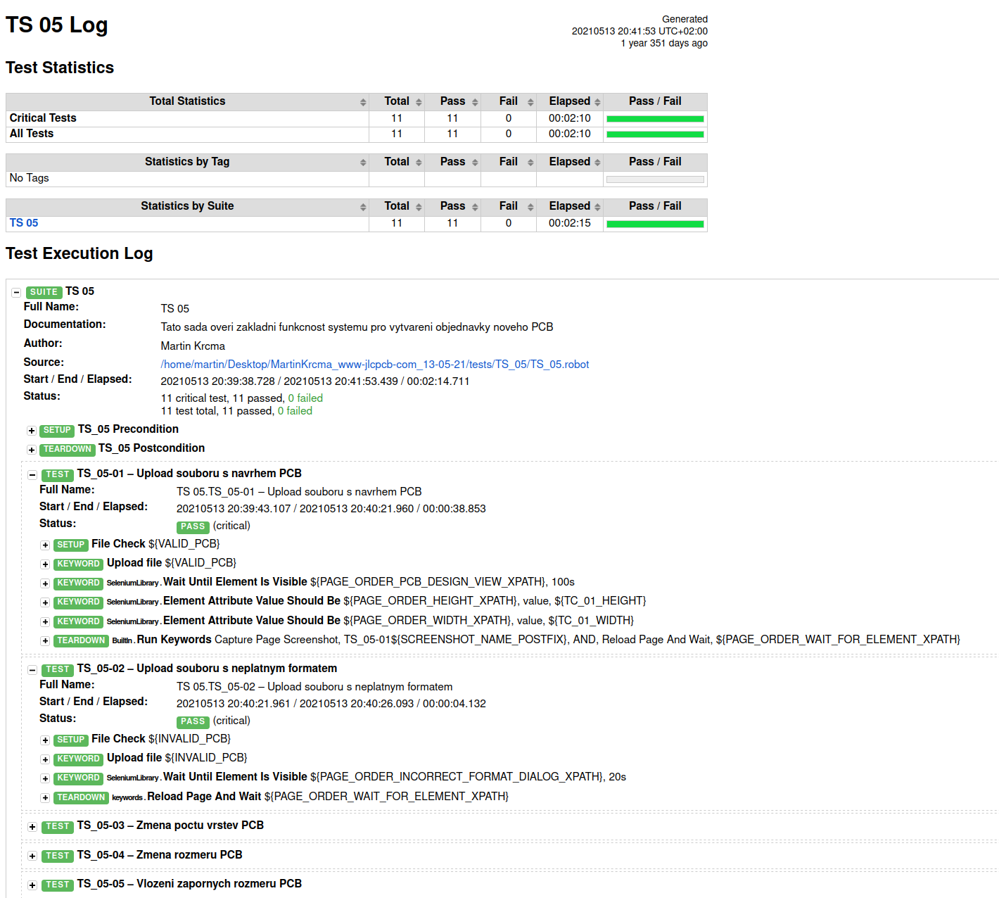

# README for jlcpcb.com website testing:

[GO BACK](https://github.com/0xMartin/UTB-FAI-programs)

> Selenium + Robot framwork

This repository contains automated and manual tests for the website https://jlcpcb.com/.
There are a total of 60 tests, including 40 automated tests using Selenium and Robot Framework, and 20 manual tests. 

The "world" folder contains complete documentation and descriptions of each test in the Czech language. The "tests" folder contains the software implementation for automated testing. 

The automated tests can be run using the script located in the "tests" folder, run_all.sh for Unix/Linux or run_all_windows.bat for Windows.

## There are a total of 8 test suites:

* TS_01 – User login
* TS_02 – User registration
* TS_03 – Navigation functionality verification
* TS_04 – UI home page
* TS_05 – PCB order creation
* TS_06 – SMT-Stencil order creation
* TS_07 – SMT component library
* TS_08 – Shopping cart

To run the automated tests, simply execute the appropriate script for your operating system. The results of the tests will be displayed in the console, and detailed logs and reports can be found in the "tests/results" folder.

