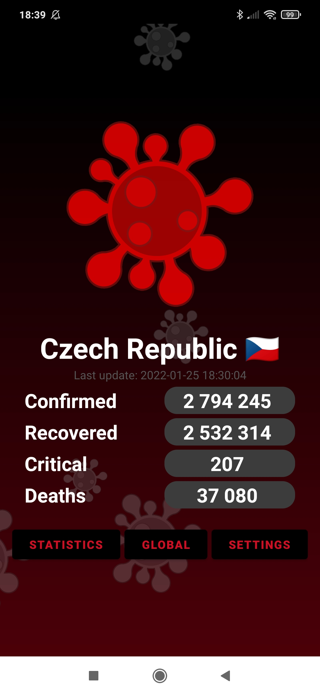

# COVID-19 app

[GO BACK](https://github.com/0xMartin/UTB-FAI-programs)

The app displays basic statistical information about the occurrence of the COVID-19 disease. On the home page, current information is displayed (number of infected, number of recovered, number in critical condition, and number of deaths) in the country selected by the user in the app settings. The app also allows users to view more detailed information (+ location of the country on the map and graph). In the global section, it is possible to see worldwide counts and also counts in any country from the list.

## Preview

   
   
   

## Settings
In the app settings, users can choose the country for which the counts will be displayed on the home page. The visibility of these displayed information can also be set in the settings.

   

