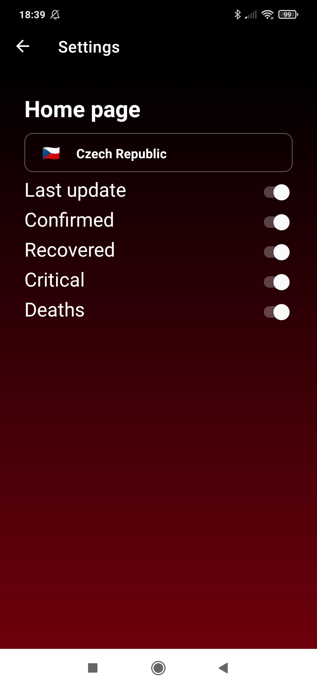

# COVID-19 app

Aplikace ukazuje uživateli základní statistické informace ohledné výskytu nemoci covid-19. Na home page jsou zobrazovaný aktuální informace (počet nakažených, počet uzdravených, počet v kritickém stavu a počet úmrtí) v zemi, kterou si uživatel zvolí v nastaveni aplikace. Aplikace také umožnuje zobrazit podrobnější informace (+ poloha státu na mapě a graf). V sekci globál je možné se také podívat na celosvětové počty a taktéž na počti v jakékoliv zemi se seznamu.

## Náhled

   
   
   

## Nastavení
V nastaveni aplikace je možné si zvolit zemi, o které se budou zobrazovat počty na home page. Těmto vypisovaným informacím je možné v nastaveni nastavit jejich viditelnost.

   

