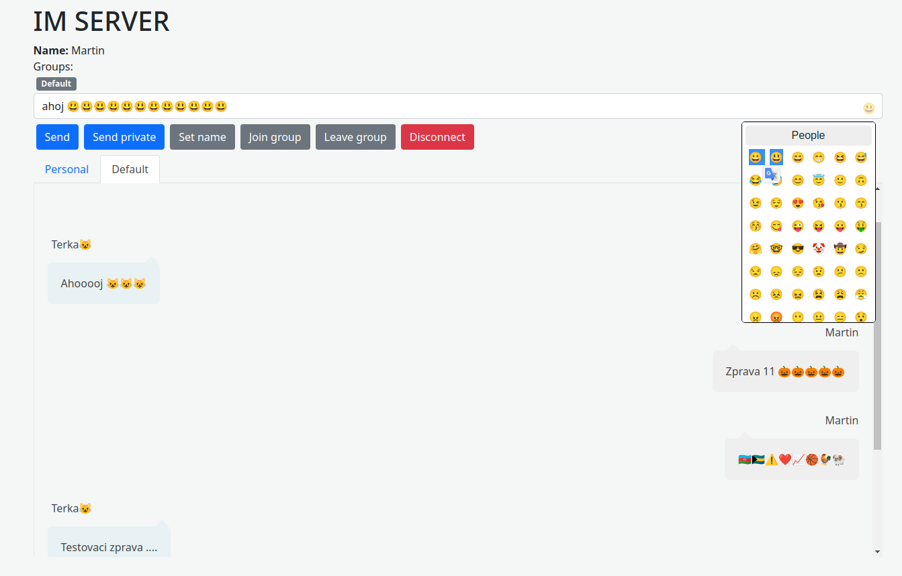

# Instant Message Server

[GO BACK](https://github.com/0xMartin/UTB-FAI-programs)

This is a simple instant message server implemented in Java using servlets. The server allows users to send messages, choose a nickname, create groups, and send private messages.

## Usage

To use the server, start the web server and deploy the servlet to the server. Once the servlet is deployed, users can access the instant message server by navigating to the server's URL in a web browser.

Upon accessing the server, users will be prompted to choose a nickname. Once a nickname is chosen, users can send messages to the main chat, create groups, and send private messages to other users.

To create a group, users can enter a name for the group and invite other users to join the group. Once a group is created, users can send messages to the group and view messages sent by other users in the group.

To send a private message to another user, users can select the user from the list of online users and send a message to them. Private messages can only be seen by the sender and recipient.

