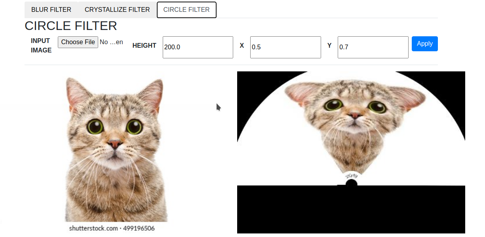

# Image Filter Servlet

[GO BACK](https://github.com/0xMartin/UTB-FAI-programs)

This is a simple Java servlet for uploading and modifying images using various filters. The servlet allows users to upload an image file and apply one of three filters: GaussianFilter, CrystallizeFilter, or RaysFilter.

## Usage

Once you have the servlet running, you can upload an image file using the provided form. The servlet will then apply the selected filter to the image and display the modified version.
Filters

## The servlet provides the following filters:
* GaussianFilter: Applies a Gaussian blur to the image.
* CrystallizeFilter: Creates a crystalline effect on the image.
* RaysFilter: Creates a ray-like effect on the image.

To apply a filter, select one from the dropdown menu and click the "Apply Filter" button. The modified image will then be displayed below.