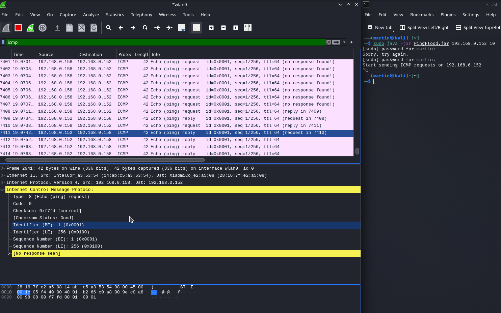

# Ping Flooder

[GO BACK](https://github.com/0xMartin/UTB-FAI-programs)

Ping-Flooder is a simple command-line tool that floods the target with a large number of ICMP packets. It is implemented in Java and uses com.savarese.rocksaw.net.RawSocket to send and receive packets. The number of threads to be used for flooding can be specified as a command-line argument.

## Usage

The command-line syntax for Ping-Flooder is as follows:

```
java PingFlooder <target_ip_address> <num_threads>
```
The available options are:

* __target_ip_address__: The IP address of the target to be flooded with ping requests.
* __num_threads__: The number of threads to be used for flooding.

## Implementation Details

Ping-Flooder is implemented in Java and uses com.savarese.rocksaw.net.RawSocket to send packets. The tool uses multiple threads to send a large number of packets in parallel, which maximizes the number of packets sent per second.

