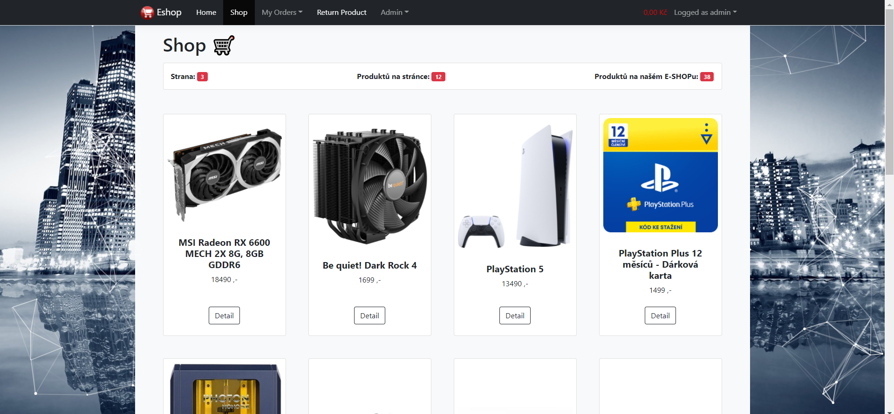
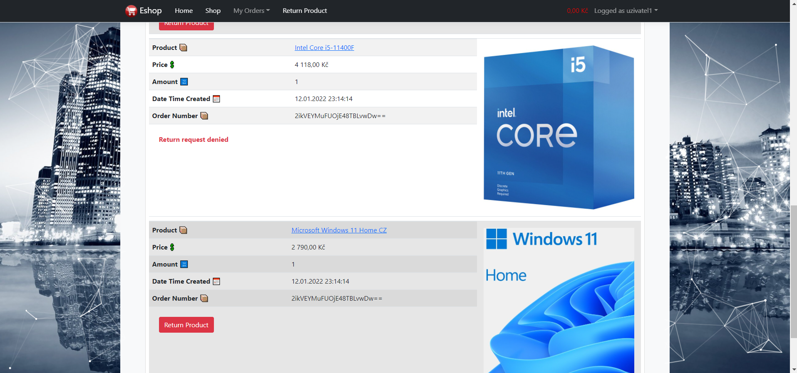

# Online Eshop Web Application

[GO BACK](https://github.com/0xMartin/UTB-FAI-programs)

> ASP.NET, Entity Framework, MS SQL

This is an online shopping web application built using ASP.NET, Entity Framework, and MS SQL Server. The application allows an administrator to manage the entire system, add new products to the store, set their parameters, price, and image. Additionally, the admin can manage all the user's orders and keep track of them.

Users can register and login to the system, they have their shopping cart where they can add items from the store. They can place their order and the system will create an order that will be processed by the admin. Additionally, users can report issues with their products, and based on the type of product, it will either be automatically processed, or a notification will be sent to the management of the online shop.

## System Architecture

The application is built using ASP.NET as the front-end, with Entity Framework as the Object-Relational Mapping (ORM) tool, and MS SQL Server as the backend database management system. The architecture is based on the Model-View-Controller (MVC) design pattern, which separates the application logic into three parts: the model (database and business logic), the view (user interface), and the controller (handles user requests and responses).

## Admin Panel

The admin panel is where the administrator can manage the entire system. The panel includes features such as:

* Add new products to the store.
* Edit existing products' parameters, price, and image.
* Manage all user orders.
* Manage all registered users.
* View reports and notifications.

## User Interface

Users can browse the products, add items to their cart, and place orders. The user interface is intuitive and easy to use. The application also provides the ability to report issues with the products. Based on the product type, system will either be automatically processed, or a notification will be sent to the management of the online shop.
Conclusion

In conclusion, this online shopping web application is built using modern web development technologies and provides all the necessary features for an online shopping experience. The application provides an intuitive user interface and a comprehensive admin panel for efficient management of the system.