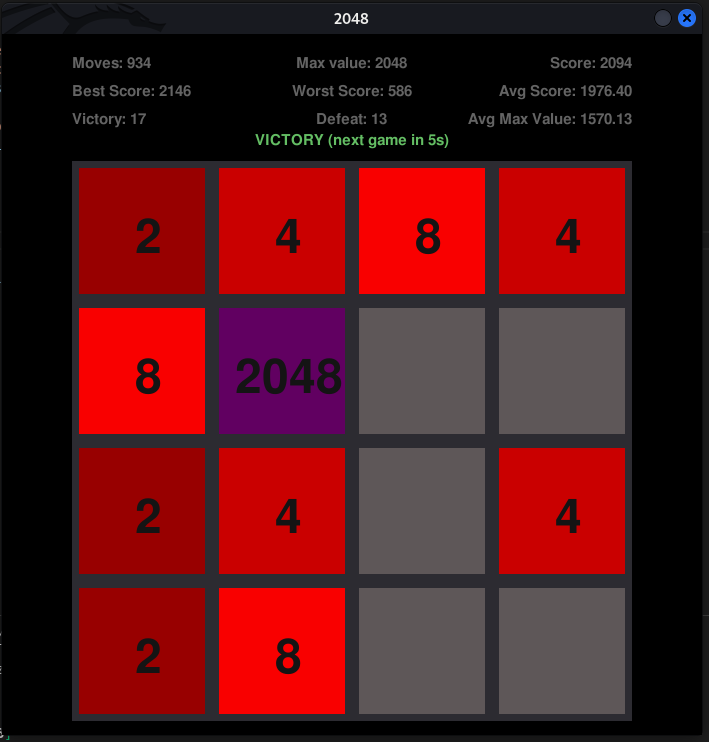

# 2048 Game with AI

[GO BACK](https://github.com/0xMartin/UTB-FAI-programs)

This repository contains an artificial intelligence that can solve the game of 2048. In addition to the AI, the repository also includes the game itself, which can be played by a user.



## How to Play
To play the game, simply run the game script and follow the prompts:
```
python3 main.py
```
Use the arrow keys to move the tiles in the game board and try to reach the 2048 tile. The game ends when there are no more moves left.

## 2048 AI Solver

This project is a solver for the 2048 game, implemented in Python using the Pygame module. It includes both a playable version of the game as well as an AI solver. The AI solver uses a probability-based algorithm to calculate the best move to make in each turn.

## Requirements

This project requires the Pygame module to be installed.