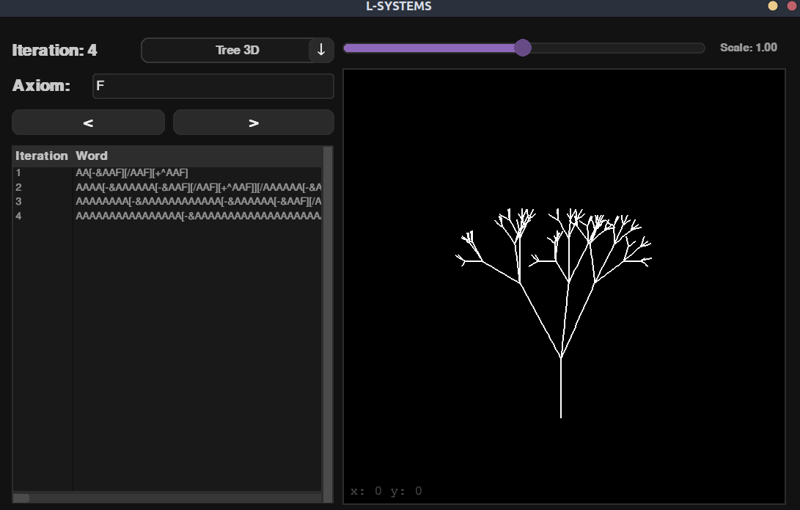

# L-Systems

[GO BACK](https://github.com/0xMartin/UTB-FAI-programs)

This is a Python program for generating and rendering L-Systems. The program allows users to define their own L-System rules and axioms, and then generate iterations of the L-System.

## Dependencies
* Python 3
* Pygame module

## Usage
1. Install the required dependencies.
1. Run main.py using Python.
1. Specify the number of iterations and the scale of the L-System in GUI.
1. Choose which type of L-System to display: 3D tree, 2D tree, Koch's snowflake, or square Sierpinski.

## Symbols Interpretation
* __A-U, 0-9__ "Draw a line segment," the segment is drawn in the direction of the brush orientation.

* __a-u__ "Move forward (without drawing)."

* __V-Z, v-z__ "Do nothing."

* __+, -__ "Turn left (respectively right) by a predetermined angle" (angle of rotation).

* __^, &__ "Turn upwards (resp. downwards) by a predetermined angle", in the case of an airplane, it would mean pitching up and down (see: pitch).

* __/, \__ "Turn left (resp. right) along the axis determined by my direction by a predetermined angle", in the case of an airplane, these commands would resemble a "banked turn," turning along the airplane's axis of flight (see: roll).

* __|__ "Turn around" (rotate by 180°).

* __[__ "Remember the current state," more precisely "save the current state to the stack" (state refers to the current position and orientation in the plane).

* __]__ "Return to the most recently remembered state," more precisely "move to the position specified by the state at the top of the stack and remove it from the stack."