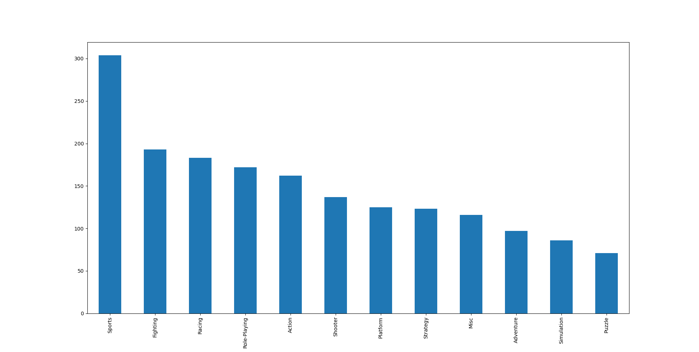
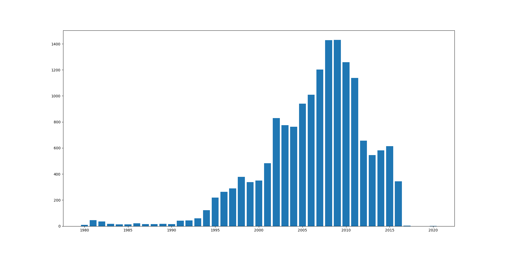
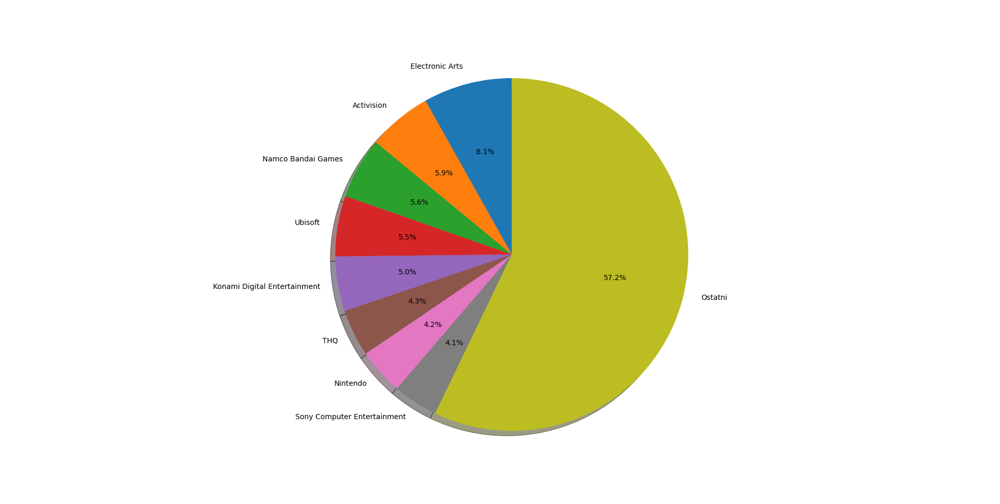

# Statistical processing of the dataset

[GO BACK](https://github.com/0xMartin/UTB-FAI-programs)

## Description

This code contains functions for statistical data processing in a pandas DataFrame file that contains information about video game sales in different regions and periods.

## Functions in this code include:
* opt_1(df, start, end) - Frequency graph of game genres in a specific period

* opt_2(df) - Calculation of the correlation coefficient for sales in Europe and North America

* opt_3(df, start, end) - Calculation of the correlation coefficient for sales in Europe and North America in a specific period

* opt_4(df) - Calculation of basic statistical indicators for differences in sales between North America and Europe for the "Sports" genre

* opt_5(df) - Number of games sold in each year

* opt_6(df) - Basic statistical indicators for sales in a specific region (user input)

* opt_7(df) - Display of the representation of game publishers in percentages

This implementation also includes the main() function, which is responsible for reading data from a file and calling individual functions according to the user's choice.

