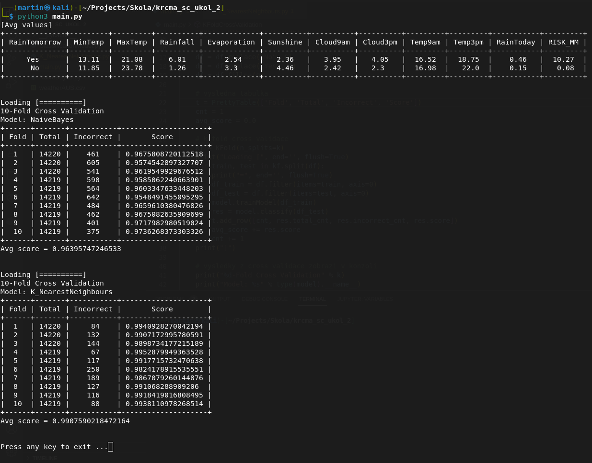

# K-nearest neighbors & Naive Bayes

[GO BACK](https://github.com/0xMartin/UTB-FAI-programs)

This Python code contains functions for weather prediction using classification models such as Naive Bayes and K-Nearest Neighbors.

The KFoldCrossValidation function performs k-fold cross-validation for the given dataset and model. The input parameters are k - the number of folds, df - the input dataset, and model - the classification model. The function trains the model on the training set and tests its performance on the testing set. The result of each fold is displayed in a pretty table showing the fold number, total number of samples, number of incorrect predictions, and accuracy score. The average score is also displayed.

The printContingencyTable function prints the contingency table for the given dataset. The contingency table shows the average values of various weather attributes such as MinTemp, MaxTemp, Rainfall, etc., for days when it rained and days when it did not rain.

The main function reads the dataset from a CSV file and calls the above functions to perform weather prediction using Naive Bayes and K-Nearest Neighbors classification models. The results are displayed in the console.

To run the code, make sure to have the pandas, prettytable, and scikit-learn libraries installed. The dataset should be in a CSV file named weatherAUS.csv in the same directory as the code.

