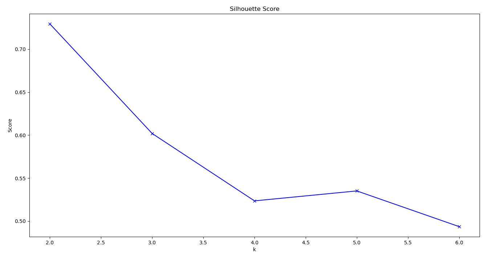
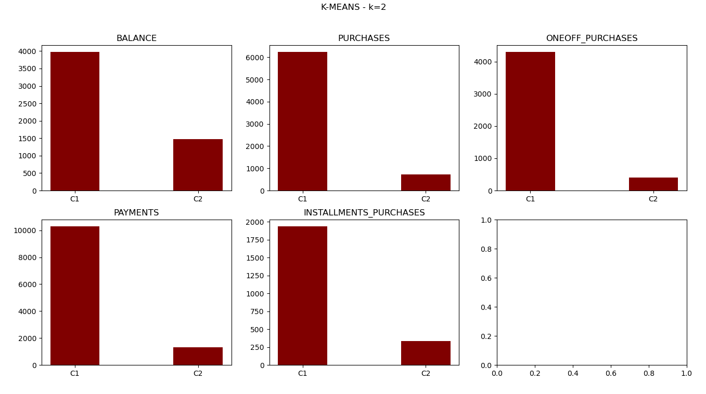
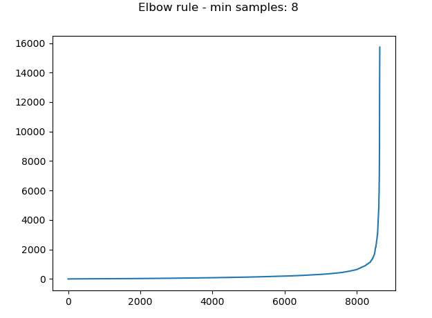
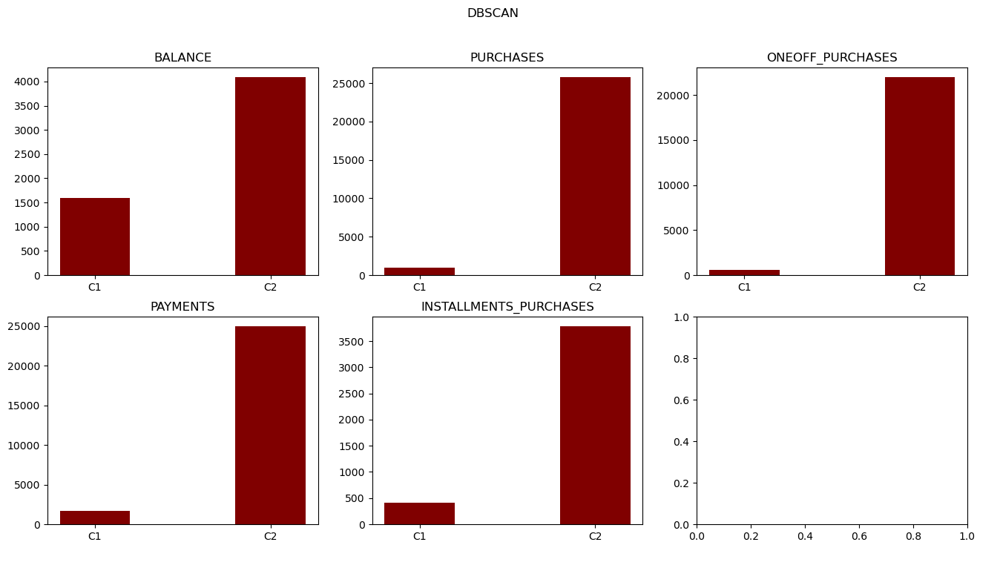

# K-nearest neighbors & Naive Bayes

[GO BACK](https://github.com/0xMartin/UTB-FAI-programs)

This script is a Python program that performs clustering on a dataset of credit card customers. It imports several libraries such as pandas, numpy, matplotlib, and scikit-learn (sklearn). The dataset is read from a CSV file ('CC_GENERAL.csv') and is preprocessed by dropping the 'CUST_ID' column and removing any rows that contain missing values.

There are two clustering methods applied to the dataset: K-means and DBSCAN. The k-means algorithm is applied first and determines the optimal number of clusters using the Silhouette Score. The KMeans class from sklearn.cluster is used for this algorithm. After determining the optimal number of clusters, KMeans is run again with the optimal number of clusters, and the results are plotted using a function called 'showSummary'.

The DBSCAN algorithm is applied next and determines the optimal parameters 'min_samples' and 'eps' using the elbow rule. The DBSCAN class from sklearn.cluster is used for this algorithm. The resulting clusters are also plotted using the 'showSummary' function.

The script defines several helper functions such as 'get_data_radiant' and 'find_elbow' to determine the optimal parameters for DBSCAN. Overall, this script provides a useful template for clustering data using K-means and DBSCAN and visualizing the results.

## K-means

## DBSCAN

