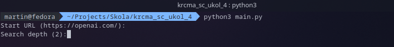
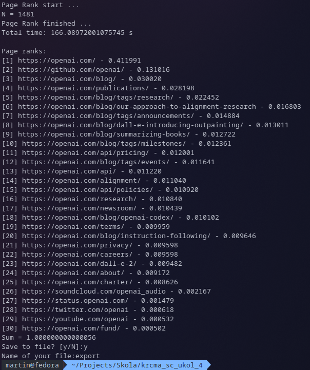

# Page Rank Algorithm

[GO BACK](https://github.com/0xMartin/UTB-FAI-programs)

This is a Python script that implements the PageRank algorithm for a web crawler. It starts by asking the user for a starting URL and a search depth, and then it crawls the web starting from that URL up to the specified depth. It uses the BeautifulSoup library to parse HTML and find links, and the requests library to download web pages.

The script builds a graph where each web page is a node, and each link between pages is an edge. It then computes the PageRank of each page using the iterative algorithm described in the original PageRank paper by Brin and Page. The PageRank of a page is a measure of its importance, based on the importance of the pages that link to it.

The script outputs the PageRank of each page it crawled, sorted in descending order. It also asks the user if they want to save the results to a file, in CSV format.

## Run script

## Result

