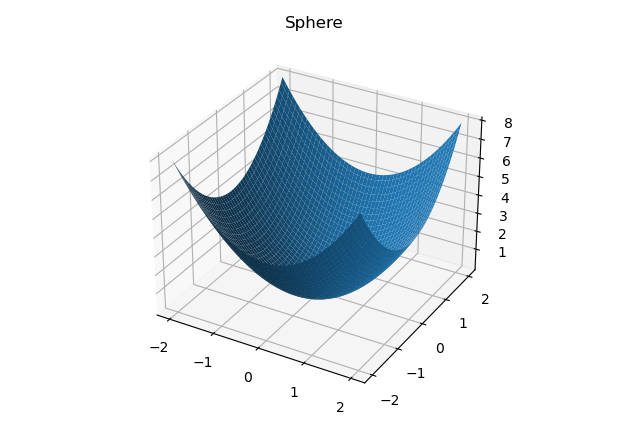

# Mathematical informatics

[GO BACK](https://github.com/0xMartin/UTB-FAI-programs)

## Task 1
The code defines several mathematical functions such as Sphere, Rosenbrock, Rastrigin, Ackley, and Booth Function, as well as a Random Search algorithm to find their minimum values.

The numpy and matplotlib.pyplot libraries are imported for numerical and graphical computations. The sphere(), rosenbrock(), rastrigin(), ackley(), and boothFunction() functions take a list of numerical values as input and return the value of the corresponding mathematical function.

The randomSearch() function takes the function to optimize, dimensionality, and maximum number of function evaluations as input and returns the best solution, the function value at the best solution, and a list of function values at each iteration.

The plotFunction() function visualizes a mathematical function as either a 2D or 3D plot. It takes the function, a boolean value to indicate whether to plot in 3D, title of the plot, and the range of values for two parameters as input.

In the main section of the code, the plotFunction() function is called to visualize each of the test functions, and the randomSearch() function is called to find the minimum of the Sphere function for 5, 10, and 20 dimensions. Finally, a convergence plot is shown for each of these calls to randomSearch().

    
    

## Task 2
This is a Python script that defines several test functions commonly used in optimization problems, and two optimization algorithms: Stochastic Hill Climber and Local Search.

The test functions defined in this script are: sphere, rosenbrock, rastrigin, ackley, and boothFunction. These functions take a list of variables and return a scalar value.

The Stochastic Hill Climber (SHC) algorithm and the Local Search (LS) algorithm are also defined in the script. These algorithms both take a function, the dimensionality of the search space, the minimum and maximum values for the search space, the maximum number of iterations, the size of the neighborhood, and the number of neighbors to evaluate. They both return the best found solution and the history of the algorithm.

Additionally, there is a helper function called plotFunctionWithPts that visualizes the history of the optimization algorithms by plotting the function and the points where the algorithms found the best solution. This function takes the function, the history of the algorithm, the best found solution, and the minimum and maximum values for the search space.

The numpy and matplotlib.pyplot libraries are imported at the beginning of the script.

    
    

## Task 3
This code implements three heuristics for function optimization: Stochastic Hill Climber (SHC), Local Search (LS), and Simulated Annealing (SA). All three heuristics share input parameters such as the dimension size (dim), the minimum and maximum parameter values (x_min, x_max), and the maximum number of iterations (max_iter).

SHC and LS differ in how they select neighbors and how they move in the solution space. SHC selects a neighbor randomly and moves in a random direction. On the other hand, LS selects a certain number of neighbors randomly and chooses the best neighbor to improve the current solution.

SA differs in that it works with temperature, which gradually decreases and affects the probability of accepting a worse solution. SA also selects a neighbor randomly and moves in a random direction in the solution space.

The output of each heuristic is the best found parameter values and the value of the objective function, as well as the history of the best objective function values during iterations.

    
    

