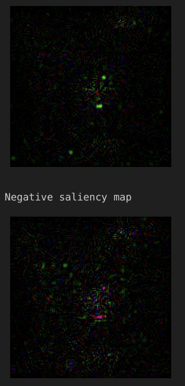
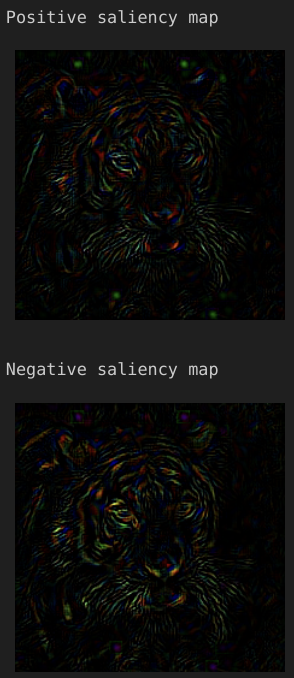
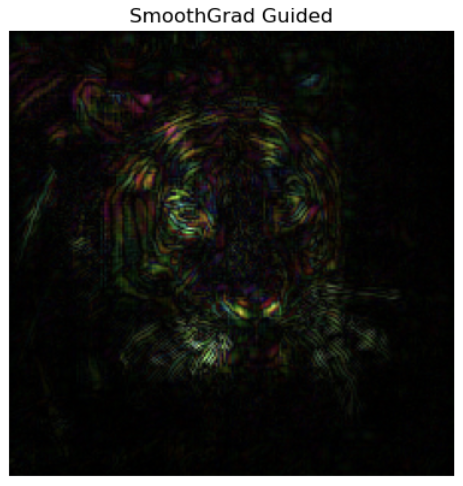
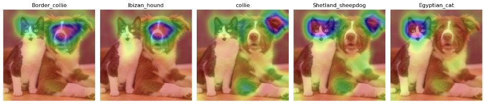
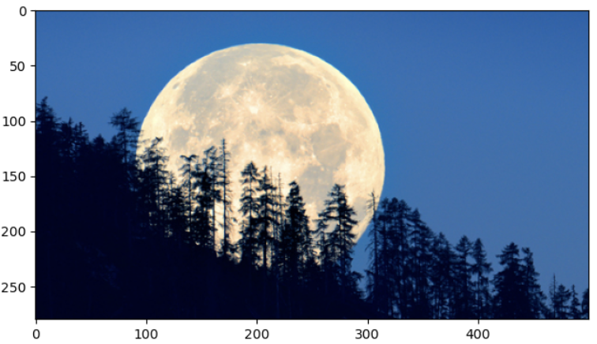
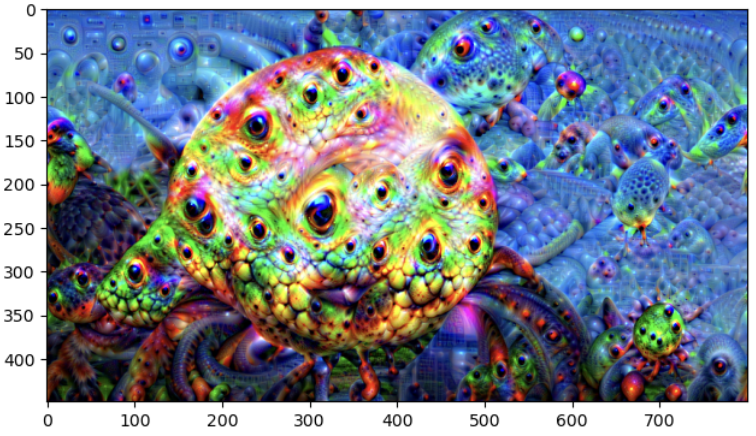

# CNN visualization + Deepdream

[GO BACK](https://github.com/0xMartin/UTB-FAI-programs)

Visualizing Convolutional Neural Networks (CNNs) provides a better understanding of how networks operate and how the learning process unfolds. There are several visualization techniques for CNNs that offer valuable insights into network behavior:

1. __Visualization of Input Images (After Augmentation) and Corresponding Network Outputs:__ This involves displaying the input images after augmentation and the corresponding outputs produced by the network. It allows us to observe how the network responds to different inputs.

1. __Visualization of Filter Weights:__ Examining the weights of individual filters helps us understand what specific filters are trying to learn and recognize within the input data.

1. __Visualization of Filter Activations:__ By visualizing the activations of individual filters, we can identify what specific features or patterns each filter is detecting in the input data.

1. __Visualization of Gradients with Respect to Input Pixels:__ This visualization technique highlights which areas of an image are most important for producing the correct output. It helps to understand the regions that have the most significant impact on network decisions.

## Positive and negative saliency map: Vanilla vs Guided Backprop

On left side are results for Vanilla and on the right side are for Guided Backprop




## Smooth Grad for Guided



## Grad-CAM activation map for the first 5 detected classes in the image 

On input image is cat and dog. Results shows activation maps for top 5 detected classes in this image.



## Conclusion of Grad-CAM

In the image 'dogandcat.jpeg,' among the first 5 detected classes (Border_collie, Ibizan_hound, collie, Shetland_sheepdog, Egyptian_cat), their respective Grad-CAM maps have been visualized. These maps highlight the areas of the image that contribute most significantly to determining each class. The class with the highest probability, 'Border_collie,' is positioned on the far left as expected. Subsequently, three other classes with lower probabilities were also identified to specify the breed of the dog.

The class with the lowest probability, 'Egyptian_cat,' exhibits a Grad-CAM map emphasizing the area where the cat is present. While the model correctly identified it as a cat, in my opinion, it might not precisely be an Egyptian cat breed.

The class 'Shetland_sheepdog' has a distinct Grad-CAM map, divided into two regions. The larger region corresponds to the cat's head, and the smaller region relates to the dog's ear. Consequently, this results in an imprecise classification for this class. However, this observation might be of less significance since it pertains to a class with lower probability.

In summary, the Grad-CAM visualizations provide insights into the model's decision-making process, revealing both accurate and less precise classifications for the identified classes.

# Deepdream

#### Input image



#### Configuration of CNN
```python
config['input'] = 'moon.jpg'
config["img_width"] = 800
config["model_name"] = SupportedModels.VGG16_EXPERIMENTAL.name
config["pretrained_weights"] = SupportedPretrainedWeights.IMAGENET.name
config["layers_to_use"] = ["relu4_2", "relu5_2"]
config["layer_weights"] = [1.0, 1.0]
config["feature_weights"] = {"relu4_2": 1.0, "relu5_2": 0.5}
config["pyramid_size"] = 5
config["pyramid_ratio"] = 1.6
config["num_gradient_ascent_iterations"] = 20
config["spatial_shift_size"] = 32
config["lr"] = 0.1
config["should_display"] = True
```

#### Output image


