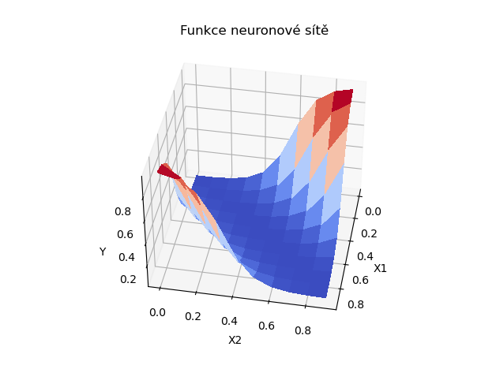
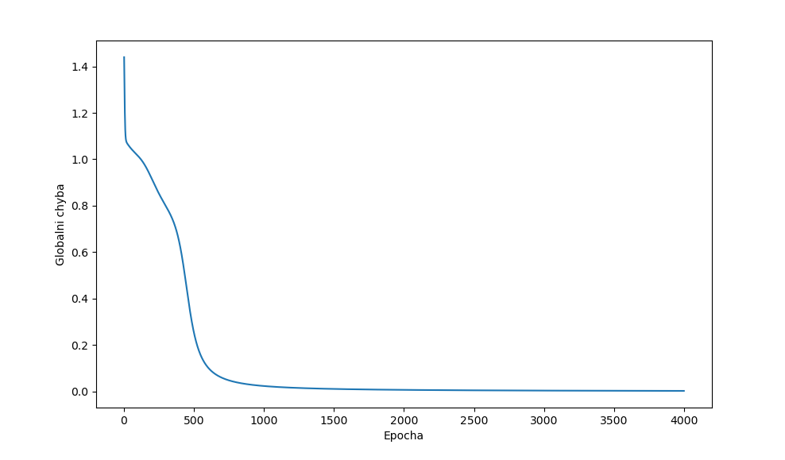
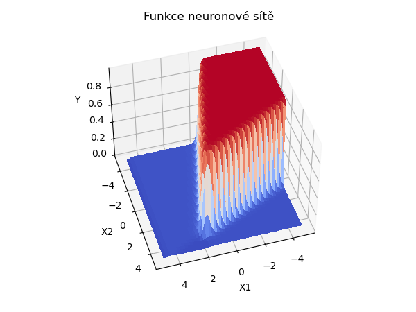
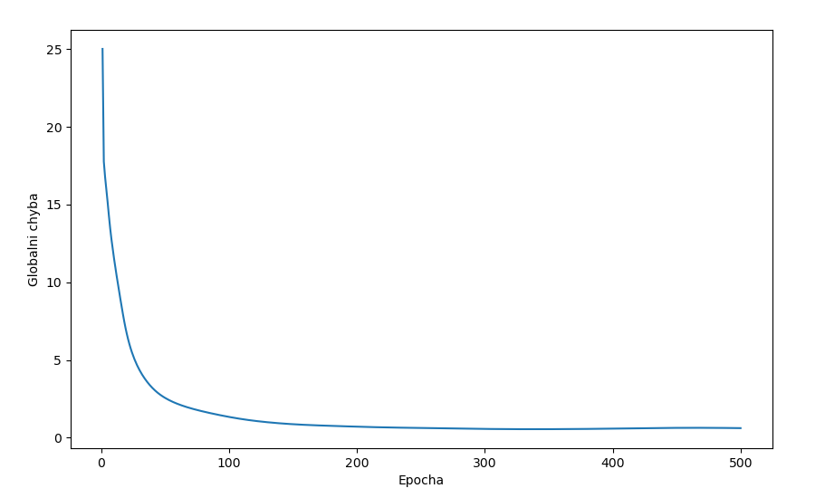

# Back propagation

[GO BACK](https://github.com/0xMartin/UTB-FAI-programs)

This is a custom implementation of a neural network with back propagation algorithm for supervised learning. The neural network is implemented using Python, and the pandas library is used to load and preprocess the input data.

## Training function
```python
    def train(self, X, T, learning_rate=0.5, momentum=0.1, epochs=100):
        """
        Train a neural network using the backpropagation algorithm.

        Parameters:
            X - Inputs of the neural network
            T - Desired outputs of the neural network
            learning_rate - Learning rate of the neural network
            momentum - Momentum of the weight update
        """
        global_err_history = []

        for _ in range(epochs):
   

            # globalni error
            error = 0

            for i in range(len(X)):
                # predict
                y = self.predict(X[i])
                error += sum((T[i] - y) ** 2)

                # output layer (caclucate delta W)
                for n in self.o_layer:
                    # delta
                    n.delta = (T[i] - n.Y) * n.Y * (1 - n.Y)
                    # weight increments for neurons
                    n.deltaW = n.X * n.delta * learning_rate + momentum * n.deltaW

                # hidden vrstva (vypocet delta W)
                for i, n in enumerate(self.h_layer):
                    # delta * sum(T[i] - y)
                    s = 0.0
                    for n2 in self.o_layer:
                        s += n2.delta * n2.W[i]
                    n.delta = n.Y * (1 - n.Y) * s
                    # weight increments for neurons
                    n.deltaW = n.X * n.delta * learning_rate + momentum * n.deltaW

                # adjusting the weight for all neurons
                for n in self.h_layer:
                    n.W += n.deltaW
                for n in self.o_layer:
                    n.W += n.deltaW
            global_err_history.append(error)

        return global_err_history
```

## Usage
1. Clone the repository and navigate to the directory
1. Run the code using python main.py

## Input Data
The code includes two examples of input data: xor.csv and data.csv. The xor.csv file contains a two-dimensional input dataset with a binary output, while the data.csv file contains a three-dimensional input dataset with a continuous output.

## Training the Network

The testNetwork function trains the neural network on the input data using the back propagation algorithm. The function takes three arguments:

    inputs: a pandas DataFrame containing the input data
    outputs: a pandas DataFrame containing the expected output data
    epochs: the number of training epochs to run

## Results
The trained neural network's weights are printed to the console, and a graph of the global error history is displayed. Additionally, a 3D visualization of the neural network's output function is shown.

### XOR
The neural network is trained on the xor.csv dataset. The dataset contains two input features and a binary output.

<div>
    
    
</div>

### Unknow function
The neural network is trained on the data.csv dataset. The dataset contains three input features and a continuous output.

<div>
    
    
</div>

