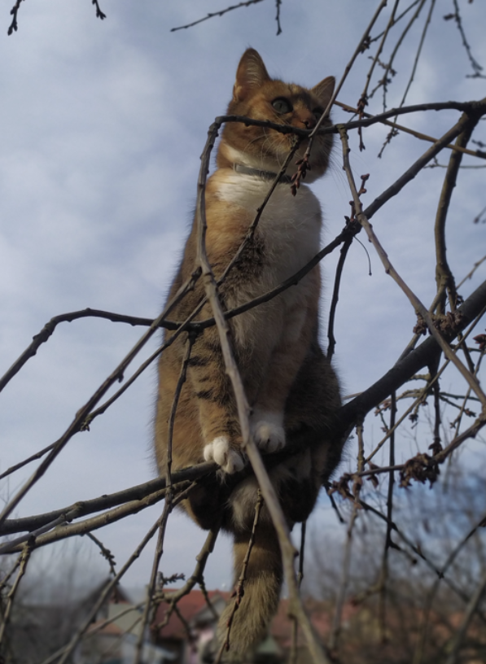
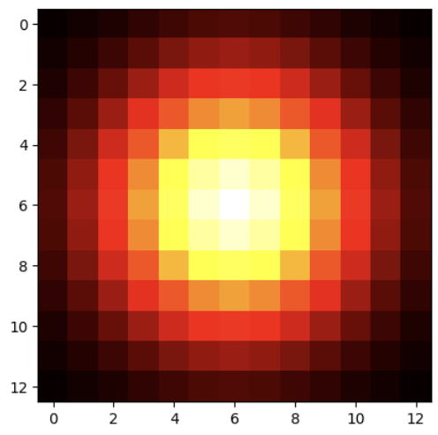
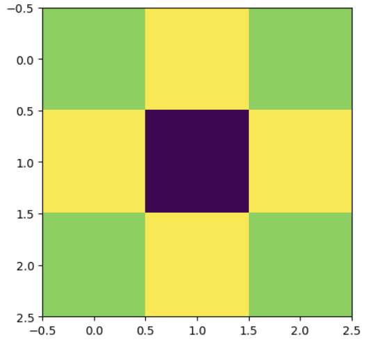
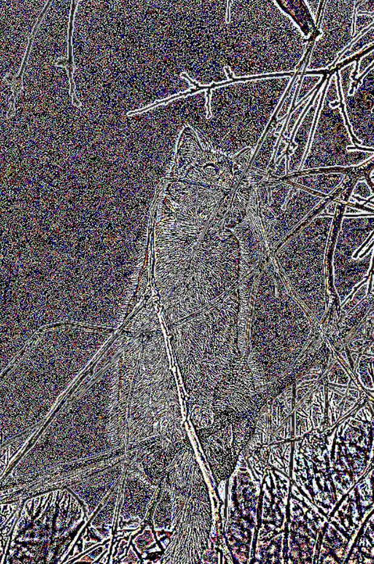

# Convolutional networks

[GO BACK](https://github.com/0xMartin/UTB-FAI-programs)

This repository contains an implementation of a Gaussian filter and Laplacian operator for edge enhancement in Python using manually tuned weights in a convolutional layer from the nn module.

## Input image

> Name: __input_img.jpg__, format: __jpg__



## Gaussian filter

Visualisation of gaussian kernel filter with size 12x12



#### Generate function

This function generate weights for gaussian kernel. You must specify size of kernel and sigma (dispersion).

```python
def generate_gaussian_kernel(size: int, sigma: float) -> np.array:
    """
    Vygenerujte 2D gaussovský operátor

    Parametry:
        size - Velikost kernelu / matice
        sigma - rozptyl

    Return: gaussovský operátor
    """
    kernel = np.zeros((size, size), dtype=np.float32)
    center = size // 2
    
    # výpočet koeficientů pro gaussovskou funkci
    coeff = 1 / (2 * math.pi * sigma ** 2)
    exp_coeff = 1 / (2 * sigma ** 2)
    
    # generování koeficientů do kernelu
    for i in range(size):
        for j in range(size):
            distance = (i - center) ** 2 + (j - center) ** 2
            kernel[i][j] = coeff * math.exp(-distance * exp_coeff)
            
    # normalizace kernelu (součet všech koeficientu = 1.0)
    kernel = kernel / np.sum(kernel)
    
    return kernel
```

#### Output image


## Laplacian filter

Visualisation of laplacian kernel filter with size 3x3



#### Output image


