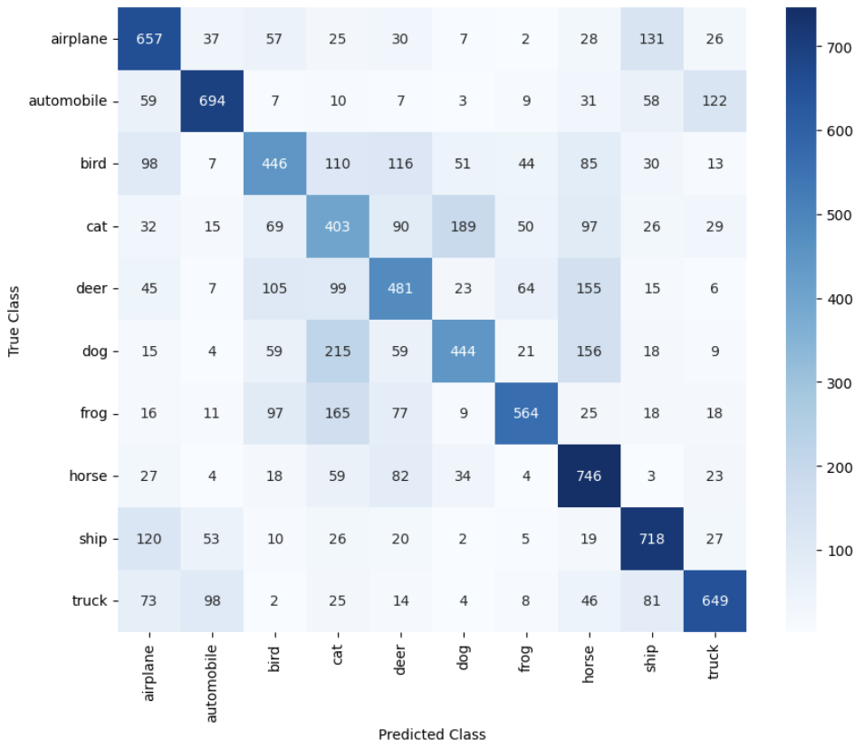

# Deep Learning Pipeline

[GO BACK](https://github.com/0xMartin/UTB-FAI-programs)

This repository contains a comprehensive deep learning pipeline for the classification of the CIFAR-10 dataset. The pipeline includes various steps to enhance the model's performance and evaluate its results.

## Task Description

In this task, we aim to improve the classification performance of a deep neural network on the CIFAR-10 dataset. The following steps are undertaken:

1. __Data Augmentation:__ We have expanded the trainloader with data augmentation techniques. Specifically, we have incorporated two or three augmentation methods from the list available here. This augmentation helps the model generalize better and improve its ability to handle diverse inputs.

2. __Batch Normalization:__ Batch normalization (nn.BatchNorm2d) has been introduced after the pooling layers in the network's architecture. This technique aids in stabilizing and accelerating the training process by normalizing activations within mini-batches.

3. __Optimizer Change:__ The optimization algorithm has been switched from Stochastic Gradient Descent (SGD) to Adam optimizer. Adam optimizer often exhibits faster convergence and better performance for deep learning models. 

4. __Training Duration:__ The model has been trained for a minimum of 10 epochs, with the preferred training duration being 25 epochs. Training for multiple epochs allows the network to learn complex patterns in the data and achieve higher accuracy. 

5. __Evaluation and Metrics:__
    * __Confusion Matrix:__ The performance of the trained network has been evaluated on the test dataset. True Positive, False Negative, and False Positive counts have been calculated to assess classification correctness. Precision and Recall scores have also been computed.
    * __Class-wise Metrics:__ The aforementioned metrics have been computed for individual classes to analyze the network's performance on each class.

6. __Confusion Matrix Visualization:__ The confusion matrix, which visually represents the predicted classes against the true classes, has been displayed. This matrix provides insights into the network's tendency to misclassify certain classes. 

7. __Results Analysis and Conclusion:__ A comprehensive commentary on the network's performance has been provided. The success of the training process is evaluated based on the achieved results. An in-depth discussion on the classification success of individual classes is presented, elaborating on reasons for success and failure. 

## How to Use
* Clone this repository to your local machine.
* Refer to the __dlp.ipynb__ notebook for step-by-step implementation and execution of the deep learning pipeline.

## Result 

## Conclusion

Based on the results, we can observe that the network managed to classify images with an overall accuracy of approximately 57.59%. However, the classification success varies among individual classes.

The best-performing classes for the model were automobile, ship, truck, and frog. These classes achieved the highest 'Recall' values. On the other hand, the model struggled the most with classifying the bird category, where it had the lowest accuracy (Recall = 0.454).

Overall, we could consider the training process relatively successful, as the number of True positives outweighs for all the classified classes. To enhance the classification accuracy, improvements are necessary for the bird, dog, and horse classes, where the results were notably poorer compared to other classes.