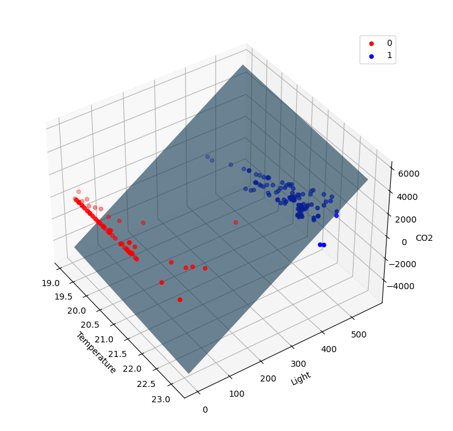

# Perceptron

[GO BACK](https://github.com/0xMartin/UTB-FAI-programs)

This project implements a perceptron and trains it on an unknown function and the XOR function.

The perceptron.py module contains the implementation of the perceptron algorithm, and the util.py module contains utility functions for loading and splitting the dataset, visualizing the dataset and learning graph, and testing the perceptron.
Usage

## To use this project, follow these steps:
1. Open the command prompt or terminal and navigate to the project directory.
1. Run the command python main.py.
1. When prompted, enter the path to the dataset file (default is perceptron_dataset.csv) and the relative size of the test dataset (default is 0.8).
1. The program will load the dataset from the file, display a 3D visualization of the dataset, split it into training and testing datasets, and train the perceptron on the training dataset.
1. After training, the program will display a learning graph showing the training progress, and then test the perceptron on the testing dataset and display the test results.
1. Finally, the program will display a hyperplane separating the dataset into two classes based on the perceptron's weights.

## Requirements

This project requires Python 3 and the following libraries:
* NumPy
* Pandas
* Matplotlib
* mpl_toolkits.mplot3d

