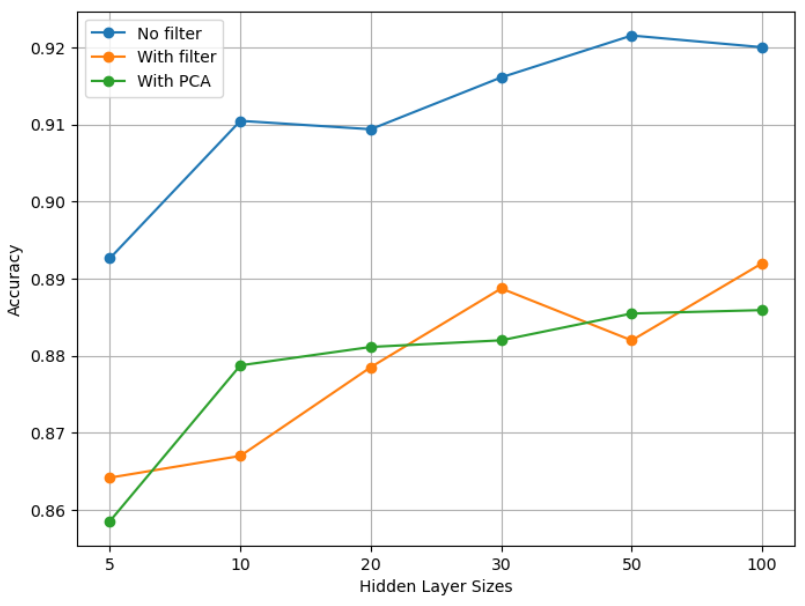

# Spam Classifier using Backpropagation Algorithm

[GO BACK](https://github.com/0xMartin/UTB-FAI-programs)

This project aims to train a neural network for spam classification using the backpropagation algorithm. The dataset used for this project is from the company Hewlett-Packard and contains statistical properties of emails along with an indicator of whether or not they are spam.

## Dataset
The dataset can be found at https://archive.ics.uci.edu/ml/machine-learning-databases/spambase/spambase.data. It contains 4,601 instances and 57 attributes.

The results of each step were recorded and analyzed to determine the optimal configuration of the neural network for spam classification.

