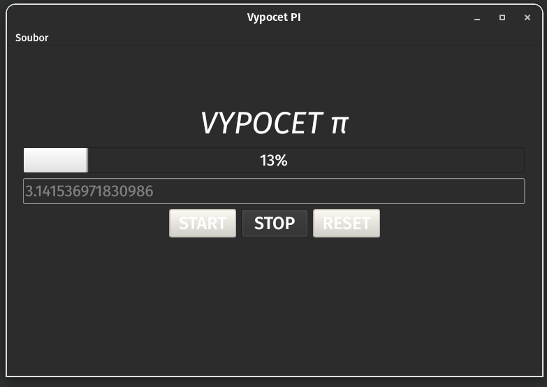
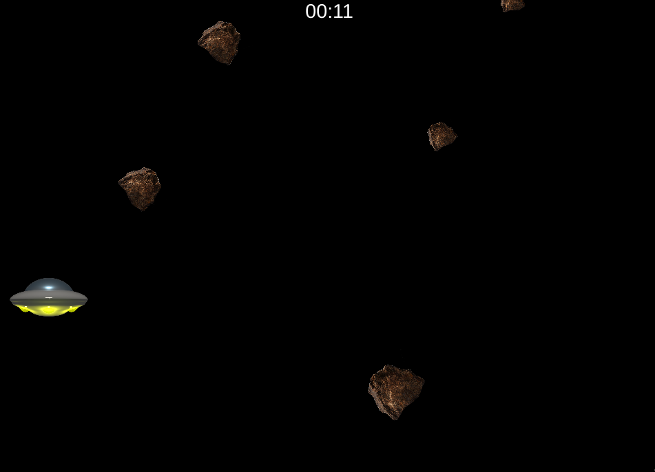
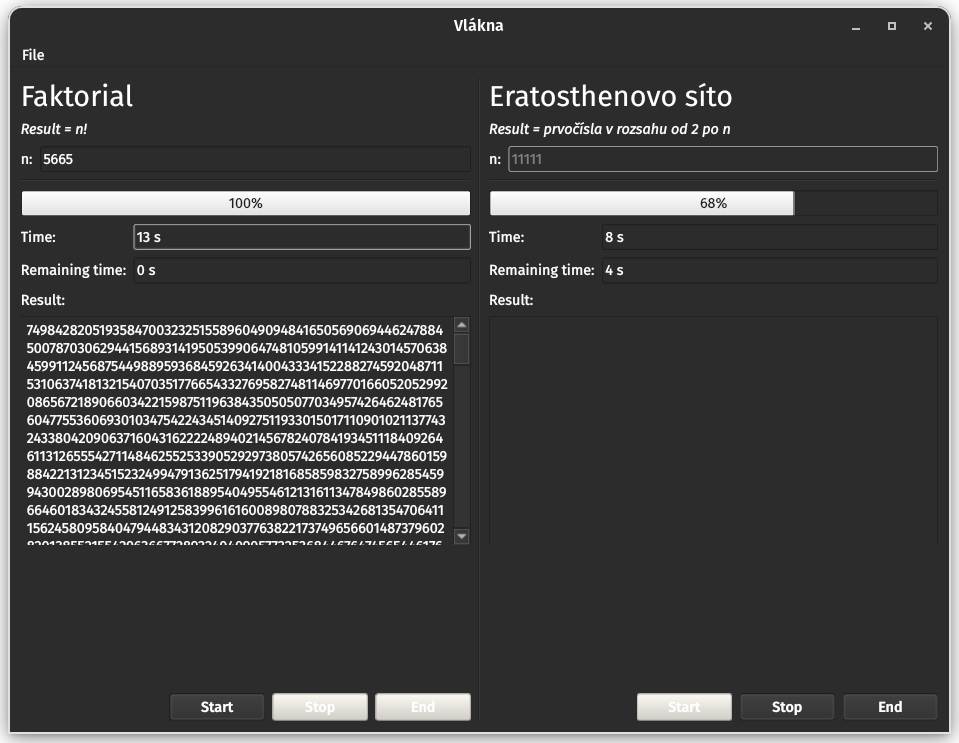
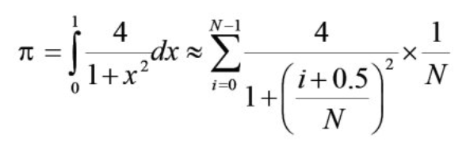
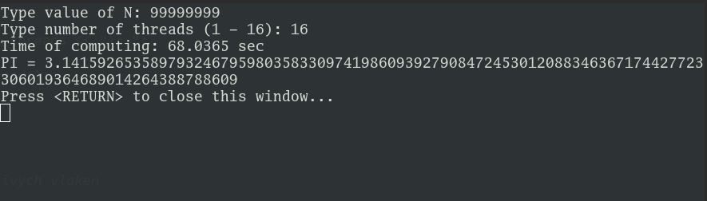

# Parallel Processes

## Calculation of PI

Utra simple program that calculate PI on background of application. Use on thread, when GUI is inactive that calculating value of PI. You can "START", "STOP", "END" calculating.

* [Calculation of PI](./task-1)

## Qt simple game

Simple "game" using Qt framwork. For rendering & physics are used QTimers. In this game you control your plane up/down to avoid collision with randomly spawning meteorites.

* [Qt simple game](./task-2)

## Using threads for time-consuming background calculations

This program can calculate PI using iteration method and prime number in selected range from 0 to N. Both calculations can run in same time. You can stop or end any of task. PI calculation uses custom lib for big numbers.

* [Using threads for time-consuming background calculations](./task-3)

## Simple OMP PI Calculation

Calculate of PI using this __formula__:

For calculation use OMP library and Boost lib for big numbers.

#### Output of program: 

* [OMP PI Calculation](./task-4)