# Signal processing

[GO BACK](https://github.com/0xMartin/UTB-FAI-programs)

## Task 1
The task was to generate three different signals with the same properties using the Python libraries numpy and scipy. The program includes a procedure that generates each signal based on its specified type and properties. The resulting signal is then plotted using the matplotlib library. Each signal is plotted separately in its own window to allow for larger viewing.

    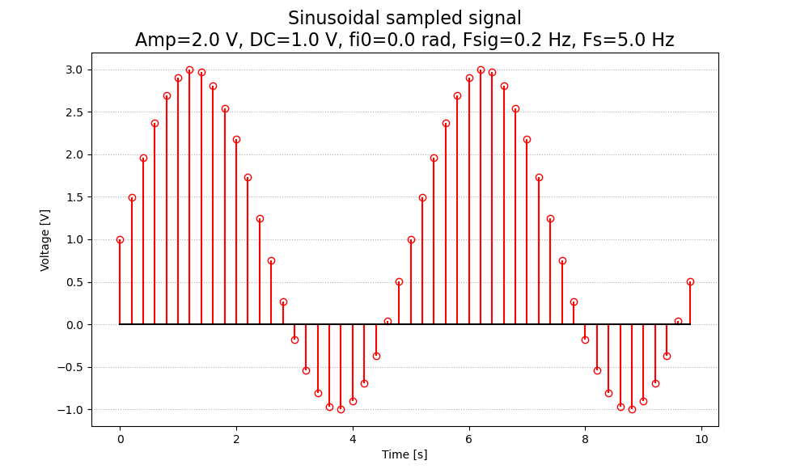
    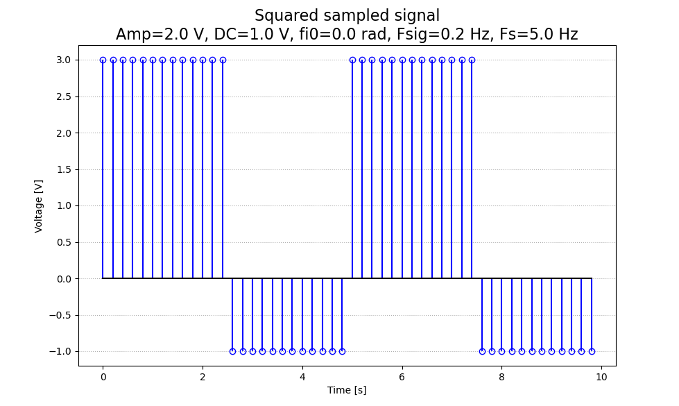

## Task 2
This is a Python script that defines several functions to generate and plot signals using the matplotlib, numpy, and scipy.signal libraries.

The aperiodicSignal function generates a triangular aperiodic signal with a defined starting time, ending time, and pulse duration. The signal is then plotted in a given plt.Axes object.

The unitImpulse function generates a unit impulse signal that occurs at a specific time impluse_n. The signal is then plotted in a given plt.Axes object.

The unitStep function generates a unit step signal that occurs at a specific time impluse_n. The signal is then plotted in a given plt.Axes object.

The functionSinc function generates the sinc function over a given time interval, which is then plotted in a new figure.

Finally, the if __name__ == "__main__" block creates a new figure with three subplots and generates a triangular aperiodic signal, a unit impulse signal, and a unit step signal, which are plotted in each subplot.

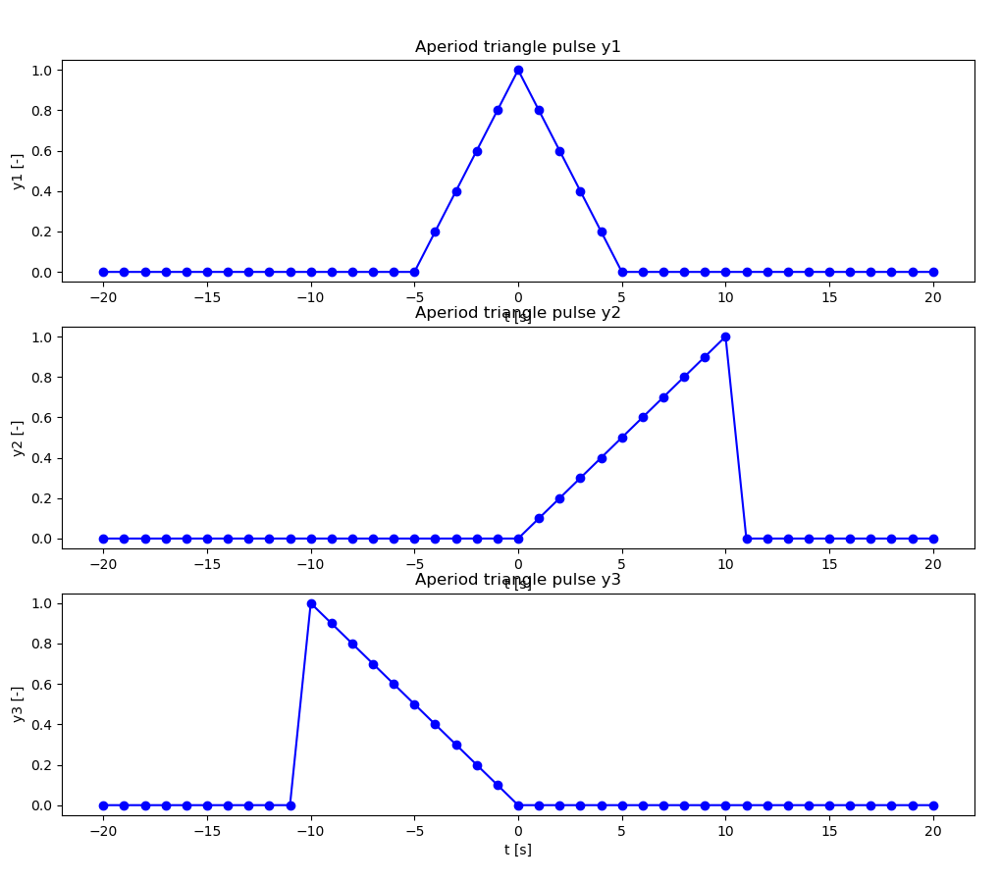
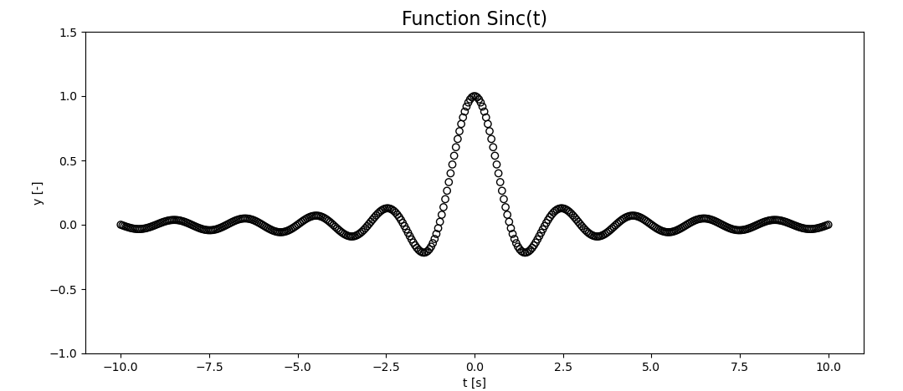

## Task 3
This code defines a class SignalCharacteristics, which calculates various characteristics of a voltage signal stored as a NumPy array. The characteristics that can be calculated include mean value, effective value, variance, standard deviation, median, instantaneous power, medium power, and energy. The class also includes a function that displays a table of the calculated characteristics and a graph of the signal's instantaneous power.

In addition, the code includes a function generateVoltageSignal that generates a voltage signal according to given parameters, and a function plotSignal that plots a voltage signal. These functions are called in the main section of the code to generate and plot a voltage signal, calculate its characteristics, and display a table of the calculated characteristics and a graph of the signal's instantaneous power.

    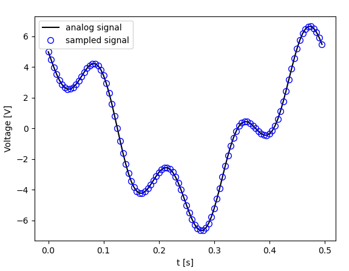
    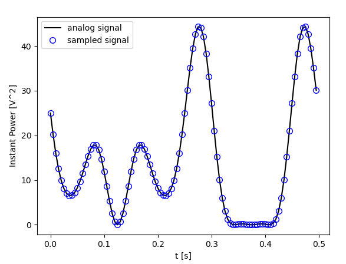

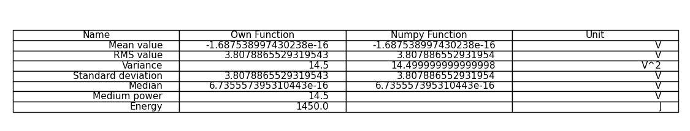

## Task 4

This code generates a signal and noise with defined properties, such as signal frequency, amplitude, DC component, sampling frequency, and SNR. The generateSignal function returns the time axis, original signal, generated noise, and the resulting signal + noise. The plotSignals function plots the original signal, generated noise, and the resulting signal + noise in two subplots.

The code generates two signals with SNR values of 10 dB and 30 dB and shows that as the SNR increases, the original signal and the resulting signal + noise become less distinguishable. Conversely, as the SNR decreases, the resulting signal + noise becomes more distorted, making it harder to identify the original signal.

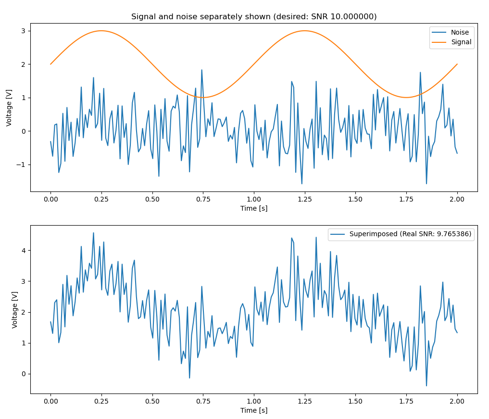

## Task 5
This is a Python code that defines a function convolve that performs convolution of two input signals using the convolution sum algorithm. The function takes two numpy arrays u and g as inputs and returns the convolution result y. The function drawSignal is also defined to plot the input and output signals using matplotlib. The main block of the code demonstrates the usage of both functions by convolving two input signals and plotting the results.

The input signals used in this code are defined as numpy arrays u and g. The convolve function calculates the convolution of u and g using the convolution sum algorithm. The resulting signal is then plotted using the drawSignal function, which plots the input signals u and g, as well as the convolution results calculated using both the convolve function and the numpy library. The resulting plots show that both methods give the same results, and the output signal y calculated using the convolve function has the desired properties.

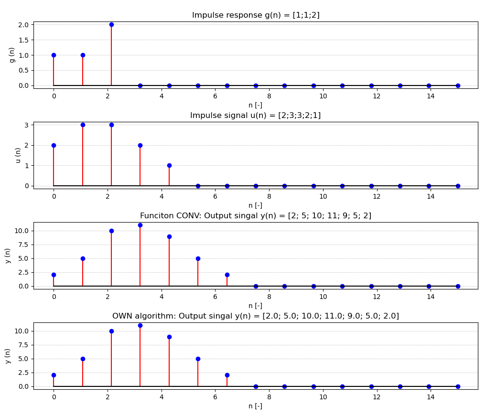

## Task 6

První úloha se zabývá úpravou audiosignálu pro dosažení efektu ozvěny s určitými parametry. Máme k dispozici audiosignál "voice_short.wav", který chceme upravit. Úprava spočívá v přidání ozvěny, která začíná po 1 sekundě záznamu a má poloviční intenzitu (hlasitost) oproti originálu.

Pro dosažení tohoto efektu budeme využívat konvoluci. V jazyce Matlab použijeme funkci conv pro konvoluci původního audiosignálu u(n) s impulsní odezvou (filtrem) g(n). Tímto výpočtem získáme modifikovaný signál y(n).

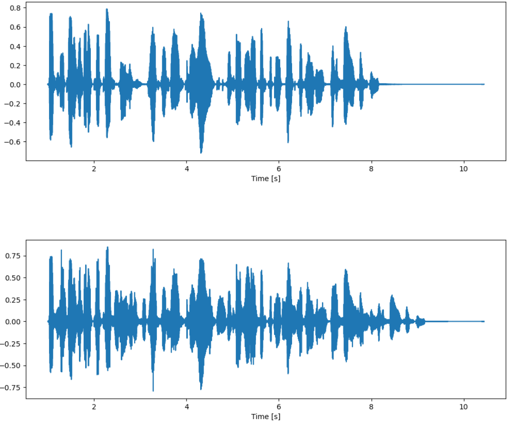

Druhá úloha se zaměřuje na modifikaci obrazového signálu "fruit_grey.jpg" pomocí 2D konvoluce a impulsních odezev (kernelů či masek) pro rozostření a zvýraznění hran.

Pro úpravu obrazu použijeme funkci conv2 vlastní implementace. Budeme aplikovat konvoluci s předem definovanými impulsními odezvami (kernely či masky). Úkolem je provést rozostření a zvýraznění hran obrazu.

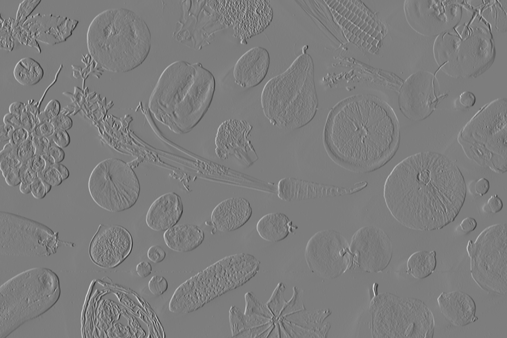

## Task 7

Úloha spočívá v aproximaci daného periodického signálu y(t) pomocí Fourierovy řady. Konkrétně se jedná o signál y(t) = t, kde t je v rozsahu <-pi, +pi>.

Pro výpočet koeficientů Fourierovy řady dle zadání je potřeba vytvořit vhodný algoritmus. Tento algoritmus bude sloužit k výpočtu koeficientů Fourierovy řady na základě zadaného signálu y(t).

Pro aproximaci Fourierovy řady budeme postupně používat různý počet členů. Konkrétně budeme aproximovat pro N = 5, 10 a 30 členů. Graficky zobrazíme 3 periody signálu, abychom mohli porovnat aproximované průběhy s původním signálem.

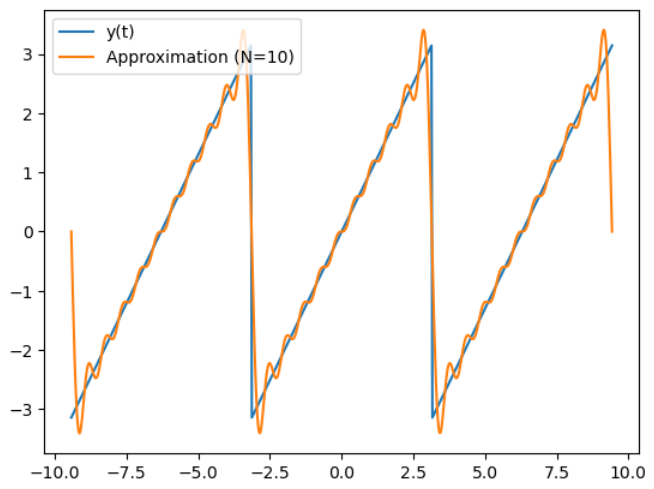

## Task 8

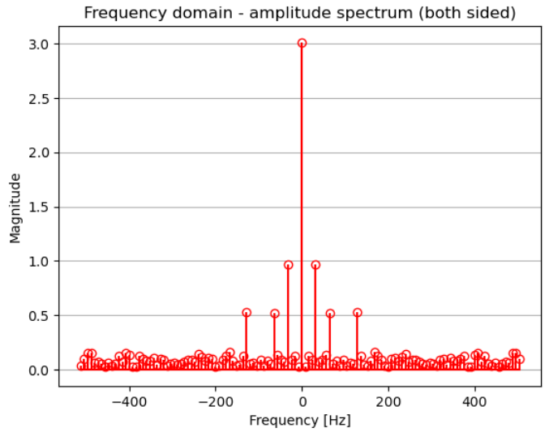