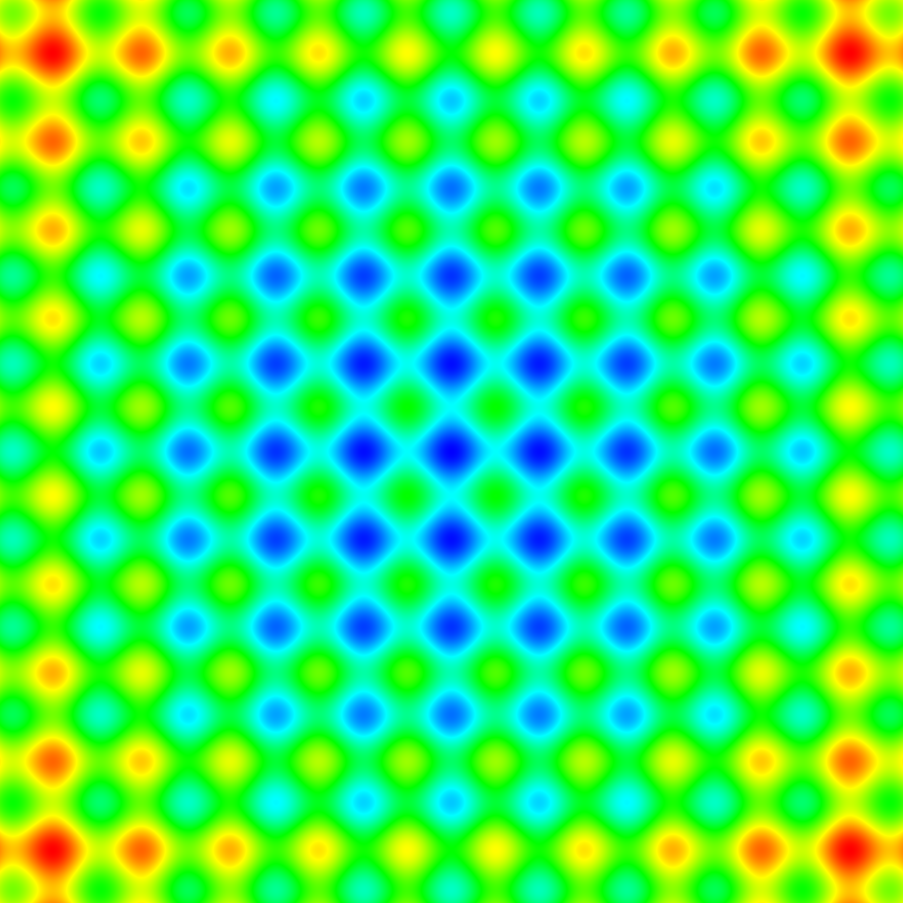
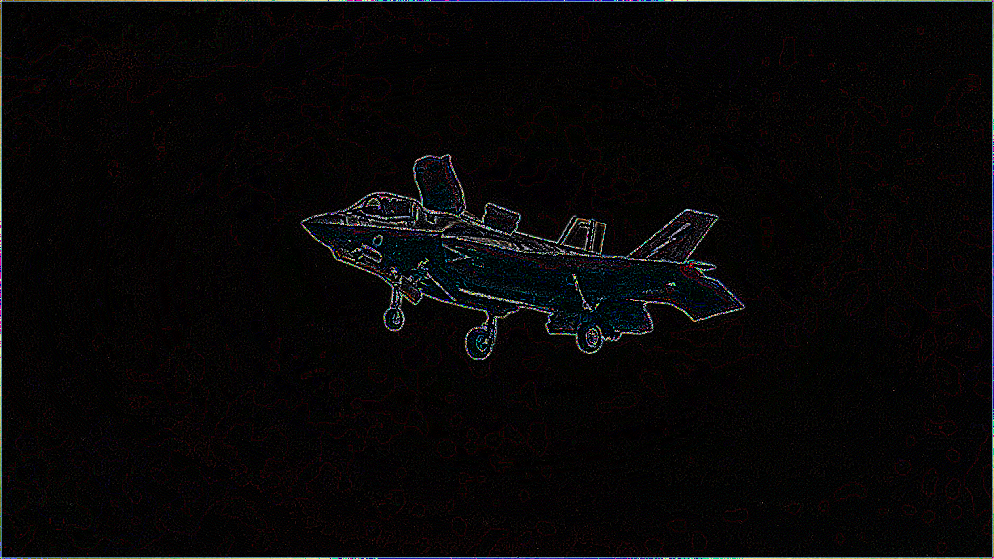
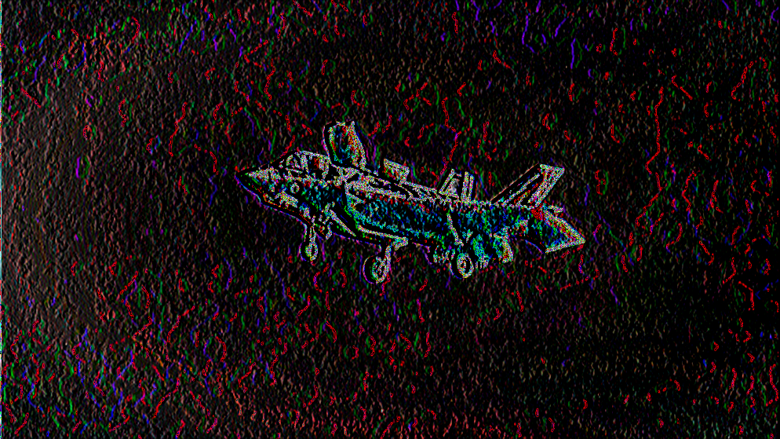
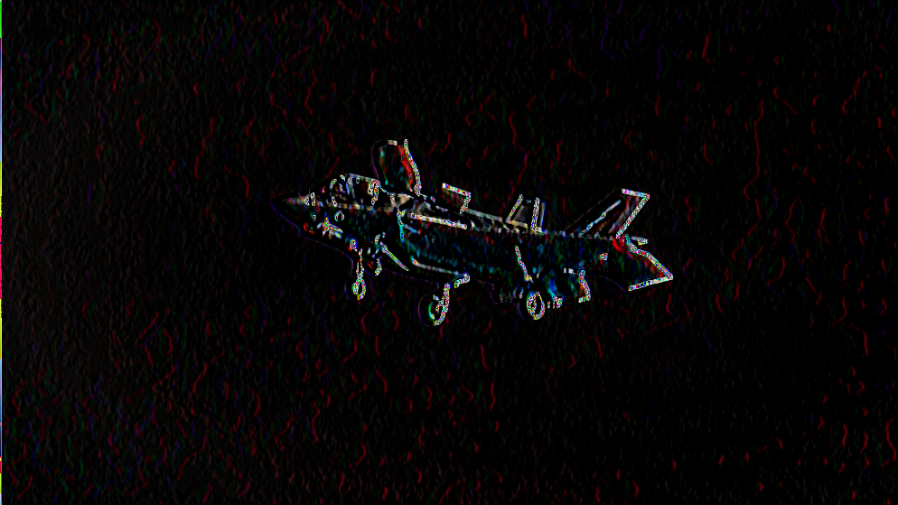
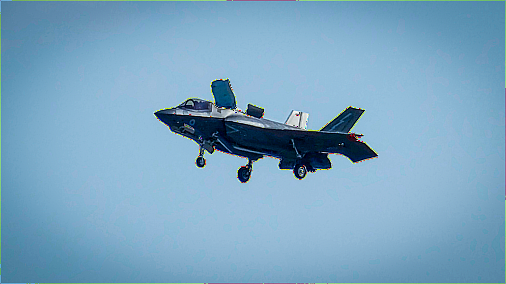
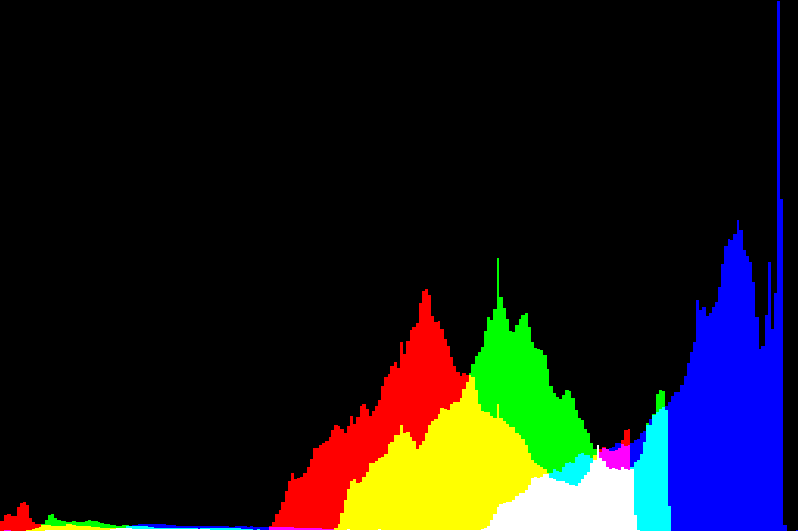
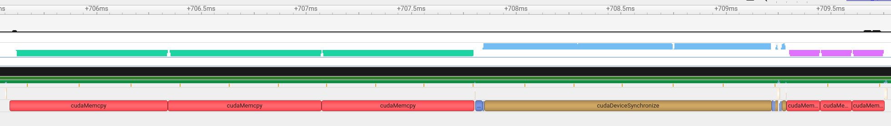
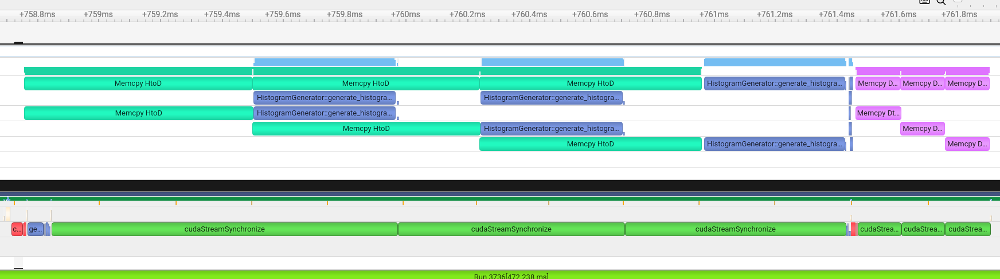

# Development of CUDA applications 

[GO BACK](https://github.com/0xMartin/UTB-FAI-programs)

There is a set of programs, from the simplest to the complex. They are all focused on programming applications that run on the GPU.

## Sum of vectors

This application implements algorithms for adding vectors of various sizes. It includes implementations for CPU and GPU, with GPU variants utilizing both manual memory allocation and memory managed approaches. The program measures the time taken for vector addition operations using std::chrono. It starts with vectors of 100,000 elements and increases the size incrementally, measuring performance for each size. The results are then redirected to a .csv file for further analysis and graphing.

```c++
/**
 * Soucet prvku ve vektoru (vektorovy soucet). Vektory A, B, OUT musi byt
 * minimalne tak velike jak je specifikovane v parametru pro velikost vektoru
 *
 * @param a         Ukazatel na vektor A
 * @param b         Ukazatel na vektor B
 * @param out       Ukazatel na vystupni vektor
 * @param size      Velikost vektoru
 */
__global__ void vector_add_gpu(unsigned int *const a,
                               unsigned int *const b,
                               unsigned int *const out,
                               unsigned long size)
{
    int tid = blockIdx.x * blockDim.x + threadIdx.x;
    if (tid < size)
    {
        out[tid] = a[tid] + b[tid];
    }
}
```

## Visualization of test function

This application creates a function called "opt" that returns a real number based on two input parameters representing positions in a two-dimensional test function, such as Schwefel's function. It provides implementations for both CPU and GPU. Additionally, it includes kernels for generating matrix values based on the test function and for creating a PNG image from the generated matrix. Proper memory allocation and kernel synchronization are ensured for correct execution.

```c++
    /// @brief Na GPU vygeneruje matici hodnot testovaci funkce v rozsahu (X ∈ [minX,maxX], Y ∈ [minY,maxY]).
    ///        Pomer (maxX - minX)/(maxY-minY) se musi rovnat (img_width)/(img_height) jinak dojde k nerovnomernemu meritku
    ///
    /// @param matrix Pointer na matici do ktere se budou vysledne hodnoty zapisovat (GPU)
    /// @param width Sirka matice
    /// @param height Vyska matice
    /// @param minX Minimalni hodnota na ose X
    /// @param maxX Maximalni hodnota na ose X
    /// @param minY Minimalni hodnota na ose Y
    /// @param maxY Maximalni hodnota na ose Y
    static void generateGPU(float *matrix_d,
                            int width,
                            int height,
                            float minX,
                            float maxX,
                            float minY,
                            float maxY)
    {
        if (abs(((float)width/height) - ((maxX - minX)/(maxY - minY))) > 0.01) {
            std::cout << "Wrong ratio, the image becomes distorted!!" << std::endl;
        }

        dim3 block_size(BLOCK_SIZE, BLOCK_SIZE);
        dim3 grid_size((width + block_size.x - 1) / block_size.x, (height + block_size.y - 1) / block_size.y);

        generateKernel<<<grid_size, block_size>>>(matrix_d, width, height, minX, maxX, minY, maxY);
        CUDA_CHECK_RETURN(cudaDeviceSynchronize());
    }
```

### Ouput image - Rastrigin 



## Image processing using 2D convolution

The application allows performing operations like blurring and edge detection on 2D images using the discrete 2D convolution algorithm. It implements multiple convolution masks that can be selected at runtime. The algorithm operates on a 3-channel (R, G, B) image and optimizes memory access using shared memory. It uses a PNG image as input and saves the modified output in the same format.

```c++
    /// @brief Aplikuje konvolucni masku 5x5 na jeden kanal obrazeku
    /// @param out_channel  Vystupni kanala obrazku (obrazek po aplikaci konvoluce) [DEVICE]
    /// @param in_channel   Vstupni kanal obrazku (puvodni obrazek) [DEVICE]
    /// @param mask         Konvolucni maska o velikosti 5x5 [DEVICE]
    /// @param width        Sirka obrazku v pixelech
    /// @param height       Vyska obraku v pixelech
    __global__ static void conv2DKernel(unsigned char *out_channel,
                                        unsigned char *in_channel,
                                        float *mask,
                                        unsigned int width,
                                        unsigned int height)
    {
        // pozice pixelu v celem obrazku
        int x = threadIdx.x + blockIdx.x * TILE_SIZE;
        int y = threadIdx.y + blockIdx.y * TILE_SIZE;

        // nacteni casti obrazku do sdilene pameti bloku (s okolnim presahem FILTER_SIZE/2)
        __shared__ unsigned char s_in_channel[BLOCK_SIZE * BLOCK_SIZE];
        int x_sbuf = x - FILTER_SIZE / 2;
        int y_sbuf = y - FILTER_SIZE / 2;
        if (x_sbuf >= 0 && x_sbuf < width && y_sbuf >= 0 && y_sbuf < height)
        {
            s_in_channel[threadIdx.x + threadIdx.y * BLOCK_SIZE] = in_channel[y_sbuf * width + x_sbuf];
        }
        else
        {
            s_in_channel[threadIdx.x + threadIdx.y * BLOCK_SIZE] = 0;
        }

        // nacteni konvolucni masky masky
        __shared__ float s_mask[FILTER_SIZE * FILTER_SIZE];
        if (threadIdx.x < FILTER_SIZE && threadIdx.y < FILTER_SIZE)
        {
            s_mask[threadIdx.x + threadIdx.y * FILTER_SIZE] = mask[threadIdx.x + threadIdx.y * FILTER_SIZE];
        }

        // synchronizace vsech vlaken v bloku
        __syncthreads();

        // provedeni 2D konvoluce
        float sum = 0.0;
        int row, col;
        if (threadIdx.x < TILE_SIZE && threadIdx.y < TILE_SIZE)
        {
            for (row = 0; row < FILTER_SIZE; row++)
            {
                for (col = 0; col < FILTER_SIZE; col++)
                {
                    sum += s_in_channel[(threadIdx.x + col) + (threadIdx.y + row) * BLOCK_SIZE] * s_mask[col + row * FILTER_SIZE];
                }
            }
            if (x < width && y < height)
            {
                out_channel[y * width + x] = (unsigned char)(sum);
            }
        }
    }
```

### Ouput image - laplacian



### Ouput image - sobel x



### Ouput image - prewitt x



### Ouput image - sharpen



## Calculation of RGB histogram

This application computes the histogram of RGB components of an input color image. It generates three images (PNG) representing the histogram of each color component or a combined image. The algorithm optimizes memory access using shared memory and implements data transfer between CPU and GPU using CUDA streams. It compares the computation time and data transfer time with and without using streams. The modified output is saved in PNG format.

### Main kernel of histogram generator

```c++
    /// @brief Kernel pro vygenerovani histogramu
    /// @param in_channel Vstupni barevny kanal obrazku (1D)
    /// @param histogram Vystupni histogram. Musi mit velikost minimalne 256 (1D)
    /// @param width Sirka obrazku
    /// @param height Vyska obrazku
    __global__ static void generate_histogram_kernel(unsigned char *in_channel,
                                                     unsigned int *histogram,
                                                     unsigned int width,
                                                     unsigned int height)
    {
        // minimalni velikost bloku musi byt takova aby platilo: blockDim.x * blockDim.y >= 256
        // pozice pixelu v celem obrazku 2D
        int x = threadIdx.x + blockIdx.x * blockDim.x;
        int y = threadIdx.y + blockIdx.y * blockDim.y;

        // 1D pozice v bloku 2D (i = x + y * width)
        int i = threadIdx.x + threadIdx.y * blockDim.x;

        // inicializace lokalniho histogramu pro blok (pro indexaci vyuzije 1D souradnici vlakna v bloku)
        __shared__ unsigned int histogram_private[256];
        if (i < HISTOGRAM_LEN)
        {
            histogram_private[i] = 0;
        }

        // nacte cast obrazku pro tento blok
        __shared__ unsigned char in_channel_shared[BLOCK_SIZE_HISTOGRAM * BLOCK_SIZE_HISTOGRAM];
        if (x < width && y < height)
        {
            in_channel_shared[i] = in_channel[x + y * width];
        }

        __syncthreads();

        // provede vypocet histogramu (lokalne)
        if (x < width && y < height)
        {
            atomicAdd(&(histogram_private[in_channel_shared[i]]), 1);
        }

        __syncthreads();

        // vsechny hodnoty lokalniho histogramu pricte ke globalnimu histogramu (pro indexaci vyuzije 1D souradnici vlakna v bloku)
        if (i < HISTOGRAM_LEN)
        {
            atomicAdd(&(histogram[i]), histogram_private[i]);
        }
    }
```

### Input image 


### Histrogram



### Default mode



### Using multiple streams


