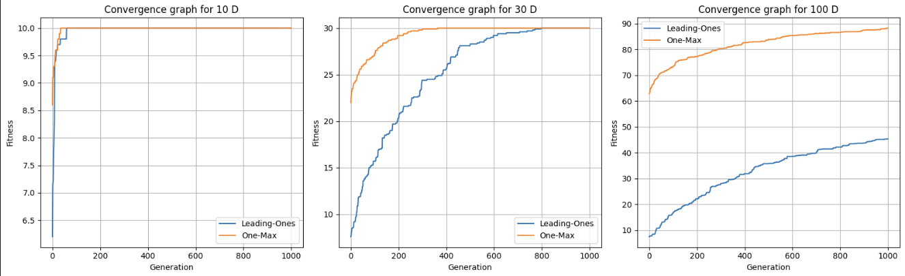
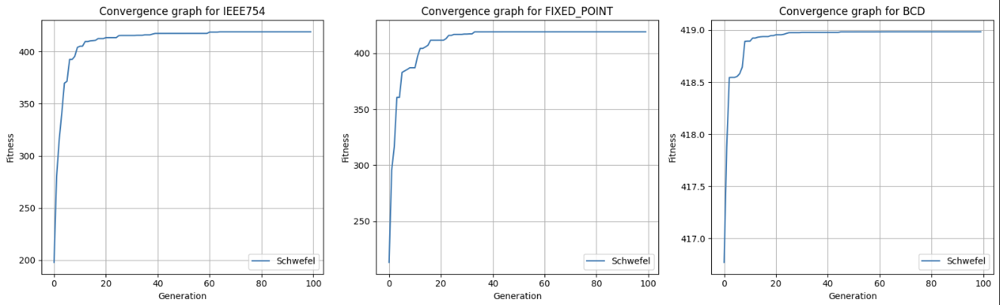
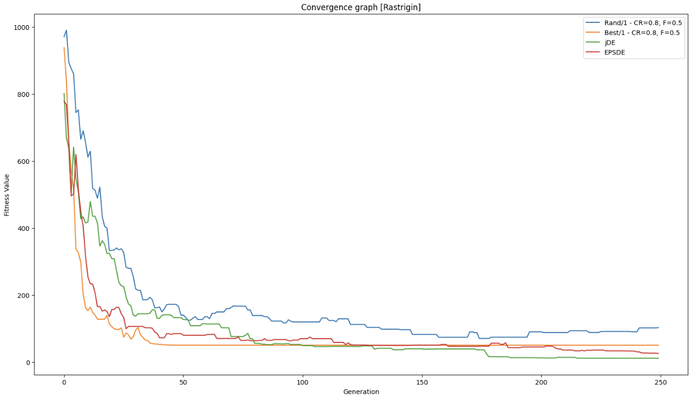
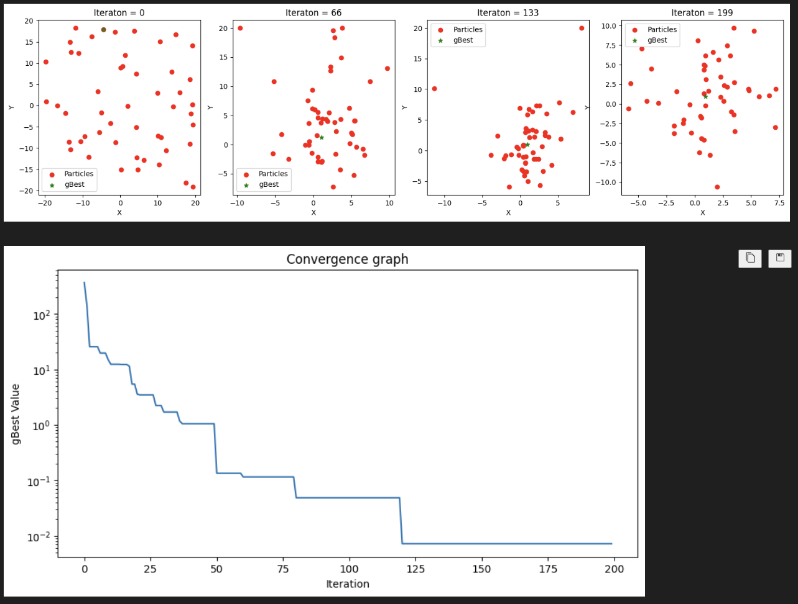
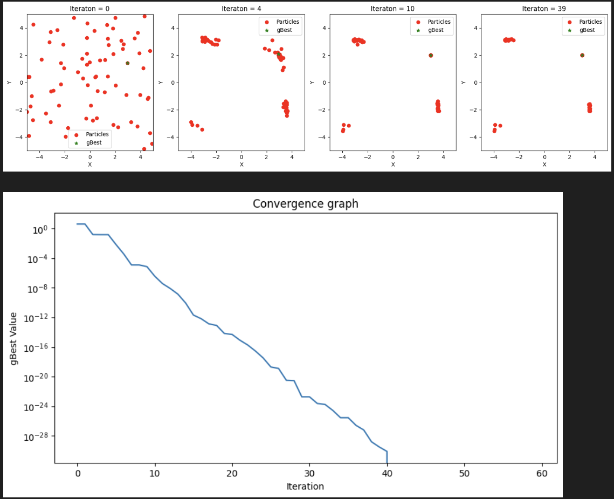
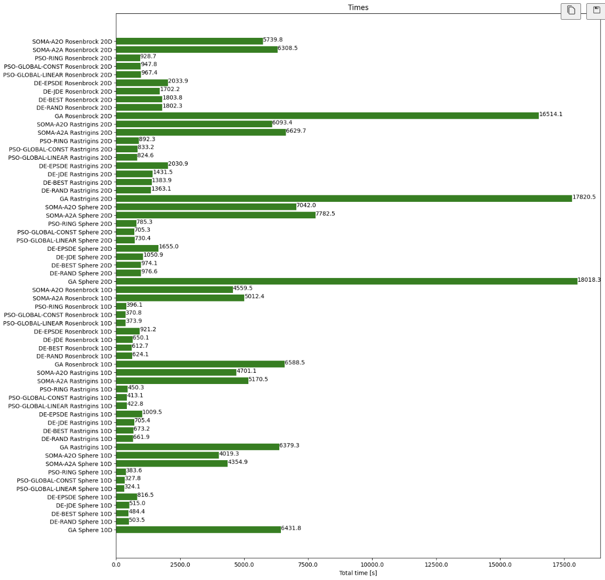
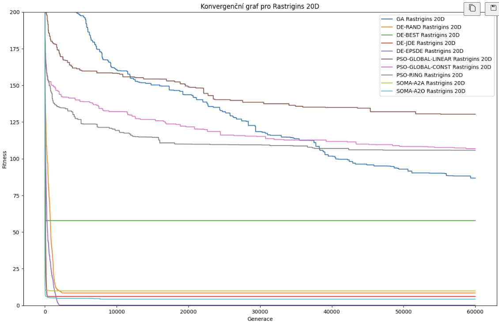

# Evolutionary computing

[GO BACK](https://github.com/0xMartin/UTB-FAI-programs)

This repository contains a collection of programs demonstrating various evolutionary computing techniques. Each section includes implementations of different algorithms used in evolutionary computation.

## 1. Genetic algorithm - binary

Implementation of a genetic algorithm that operates on binary-encoded solutions. This example demonstrates how binary strings are used to represent solutions and how genetic operators such as selection, crossover, and mutation are applied to evolve better solutions over time.

[Program Link](./genetic_algorithm_bin.ipynb)

## 2. Genetic algorithm - real

A genetic algorithm that uses real-number encoding. This example shows the adaptation of genetic operators for real-valued solutions, including techniques like real-valued crossover and mutation, and discusses the benefits and challenges of this approach.

[Program Link](./genetic_algorithm_real.ipynb)

## 3. Differential evolution

Implementation of the differential evolution algorithm, which is particularly effective for continuous optimization problems. This section covers the differential mutation and crossover strategies that drive the evolution of candidate solutions.

[Program Link](./differential_evolution.ipynb)

## 4. PSO

An implementation of the PSO algorithm, which simulates the social behavior of birds flocking or fish schooling to find optimal solutions. This part details how particles are initialized, how their velocities are updated, and how they converge towards optimal solutions.

[Program Link](./pso.ipynb)

## 5. SOMA

Explanation and implementation of SOMA, an optimization algorithm inspired by the social behavior of individuals in a population migrating towards a leader. This section highlights the algorithm's unique strategies and its application to optimization problems.

[Program Link](./soma.ipynb)

## 6. Comparison of all

A comparative analysis of the performance and characteristics of the aforementioned algorithms. This section includes benchmark results, discussions on the strengths and weaknesses of each approach, and guidelines on selecting the appropriate algorithm for different types of problems.

[Program Link](./comparison_of_all/main.ipynb)

