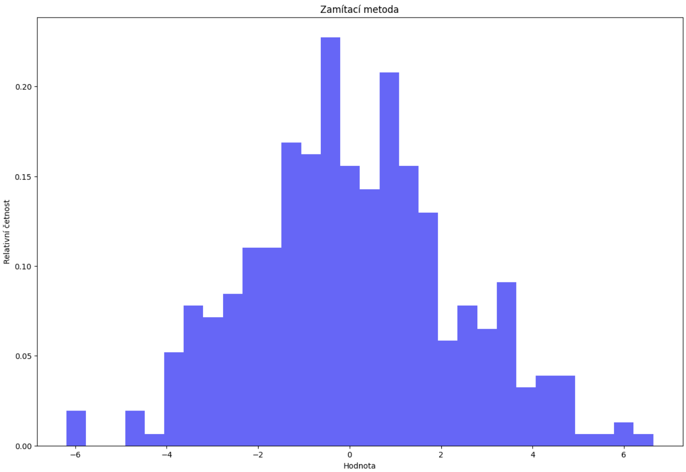
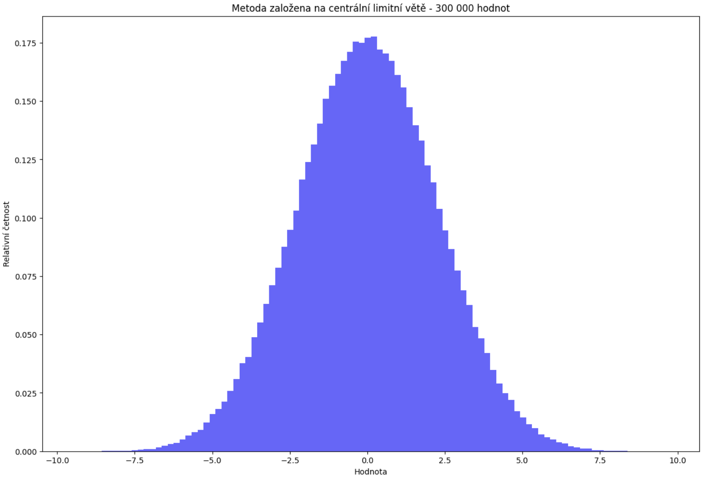

# Random number generator

[GO BACK](https://github.com/0xMartin/UTB-FAI-programs)

This program simulates a random number generator that produces values following a specified **normal distribution** using two methods: the **rejection method** and the **central limit theorem (CLT) method**. It generates files containing 360 random numbers for each method, with the normal distribution having a mean of 0.0 and a variance of 5.0.

The program verifies the correctness of the generated distribution through graphical plots and computes statistical characteristics such as mean, variance, standard deviation, median, and the 25th and 75th percentiles.

## Usage

```python
mean_value = 0
variance_value = 5

rndGenerator = NormRandom(mean=mean_value, variance=variance_value)

rnd_num = rndGenerator.generateRandom(type=MethodType.CENTRAL_LIMIT_THEOREM)
```

## Graphs



